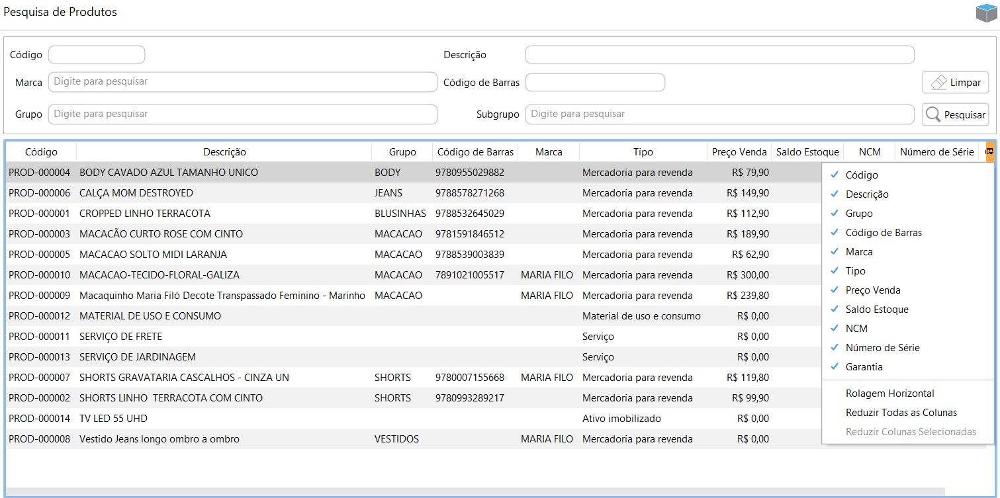

{: #produto}

### Produto

Nesta  tela devem ser cadastrados todos os produtos que a empresa utiliza em suas transações comerciais. 

Na tela de pesquisa vários campos importantes são visíveis na grade. Os Campos que ficam visíveis na grade são personalizáveis, podendo ser ocultados da grade se desmarcados do menu de personalização da tela.

{: #cadastro}

#### Cadastro de Produto

Na parte superior da tela de cadastro de produto estão as informações e classificações básicas do produto, como [Marca](estoque_marca.md#marca) e [Grupo](estoque_grupo_subgrupo.md#grupoproduto).

A parte inferior da tela de cadastro é dividida em abas.

{: #fiscaisimpostos}

#### Cadastro de Produto- Fiscais/Impostos

Na aba Fiscais/Impostos devem ser parametrizadas as informações fiscais do Item. Os campos de *NCM, Tipo de mercadoria* e *CEST* são levados para o DANFE e XML dos documentos fiscais emitidos.

O Grupo de imposto dos Impostos de Vendas são utilizados para o cálculo dos impostos na Venda e Devolução de Venda. O Grupo de imposto dos Impostos de Compras são utilizados para o cálculo dos impostos na Compra e Devolução de Compra.

{: #estoque}

#### Cadastro de Produto- Estoque

Nesta aba podem ser parametrizadas as dimensões de estoque que o produto irá utilizar. Todas as dimensões criadas no [cadastro de dimensão de estoque](sistema_ajustes_dimensao_estoque.md#dimensaoestoque) ficam disponíveis no cadastro do produto, mas somente as que forem marcadas na aba estoque serão utilizadas pelo produto.

Os parâmetros de *Estoque Máximo* e *Estoque Mínimo* são para o gerenciamento do estoque.  A unidade de Medida é a que controle o estoque e também que é informada nos documentos fiscais emitidos.

{: #venda}

#### Cadastro de Produto- Venda

Ao cadastrar um produto novo o campo *Custo Médio*, fica habilitado para ser informado manualmente o valor de custo do produto, caso não seja, ele será preenchido com o valor de custo da primeira entrada de mercadoria, que pode ser feita via compra ou via movimentação manual de estoque.

Uma vez que houver movimentação do produto o campo Custo médio fica desabilitado, não podendo ser alterado manualmente.

O Custo médio é calculado pela média dos preços de custo das entradas de produto. A cada nova entrada o custo médio é recalculado automaticamente pelo sistema.

No Campo *Margem* deve ser informada qual a margem de lucro desejável na venda do produto. Esse campo é preenchido manualmente e pode ser alterado a qualquer momento. É através da margem informada que o sistema calcula o valor no campo *Preço Sugerido.*

No campo *Preço de venda*  deve ser informado o valor de venda do produto. O valor do preço de venda pode ser definido ou alterado também através da rotina de [Revalidação de Preço de Venda](estoque_revelidacao_preco_venda.md#revalidacaoprecovenda). Se o preço de venda informado for diferente do preço de venda sugerido o campo *Margem Calculada* irá informar qual a margem de lucro para este preço de venda, com base no custo médio.

{: #informacoesadicionais}

### Cadastro de Produto- Informações Adicionais

Nesta aba podem ser informadas delimitações de tamanho, localização, série e garantias do produto.

{: #observacoes}

#### Cadastro de Produto- Observações

Neste campo podem ser descritas qualquer outras informações relevantes ao produto. Essas informações são apenas para consulta no cadastro do produto.

[Voltar](estoque.md#estoque)

