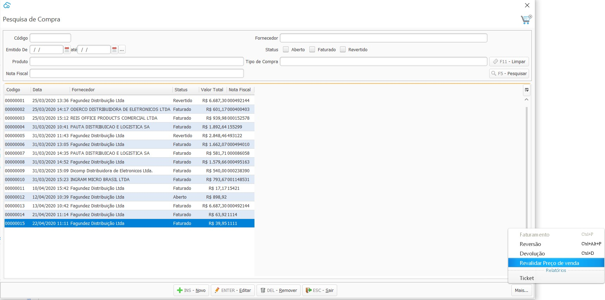
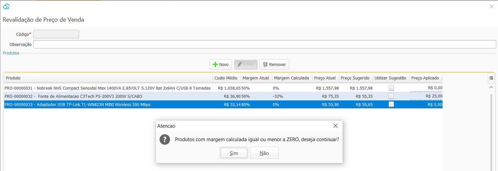

[Início](index.md) / [Estoque](estoque.md) / Revalidação de Preço de Venda

### Acesso para o menu Revalidação de Preço de Venda

O menu Revalidação de Preço de Venda pode ser acessado através do menu próprio em Estoque, ou através do atalho disponível na pesquisa de Compra.

{: #pesquisa}

#### Pesquisa de Revalidações de Preço de Venda

Na tela de pesquisa estão disponíveis os processos que já foram efetuados, os revertidos e também os que se iniciaram mas ainda não foram efetuados. 

****

{: #cadastro}

#### Revalidação de Preço de Venda

Ao criar um novo processo de Revalidação de Preço de Venda a partir de uma compra, o sistema irá trazer automaticamente todos os itens da Compra.

Nesta tela de Revalidação de Preço de Venda estão disponíveis o *Custo médio* calculado para o produto, a *Margem  atual*, que é Margem informada manualmente no cadastro do produto,  o *Preço Atual* do produto e o *Preço Sugerido*, que é o Custo médio + Margem atual.

Se o campo *Utilizar Sugestão* for marcado o sistema irá preencher automaticamente o campo *Preço Aplicado* conforme o *Preço Sugerido.* Esta ação pode ser vista na primeira linha da tela abaixo.

Se o campo *Utilizar Sugestão* **não** for marcado o campo o campo *Preço Aplicado* pode ser informado manualmente, assim o sistema irá calcular o campo *Margem Calculada*. Esta ação pode ser vista na segunda linha da tela abaixo.

Ao clicar em gravar o sistema pergunta se deseja efetuar as transações:

Se Não, o sistema irá salvar o processo com status: ABERTO e o  processo poderá ser efetuado em outro momento.

Se Sim, o sistema fazer a atualização do preço de venda de todos os itens listados no processo de acordo com o informado no campo Preço Aplicado. E irá salvar o processo com status: EFETUADO. 

Se a Margem Calculada pelo sistema for igual ou menor que zero, isso ocorre no caso do preço aplicado for menor que o Custo médio, quando clicar em gravar o sistema irá emitir um alerta informando que algum item está com Margem calculada igual ou menor que zero, onde o processo poderá ser cancelado ou efetuado.

{: #reverter}

#### Reverter

Para as Revalidações de Preço de Venda com Status: EFETUADO, no botão mais está disponível a opção Reverter. 

Ao confirmar a reversão o Status do processo será alterado para REVERTIDO e as alterações de preço feitas no processo serão desfeitas.

[Voltar](estoque.md#estoque)