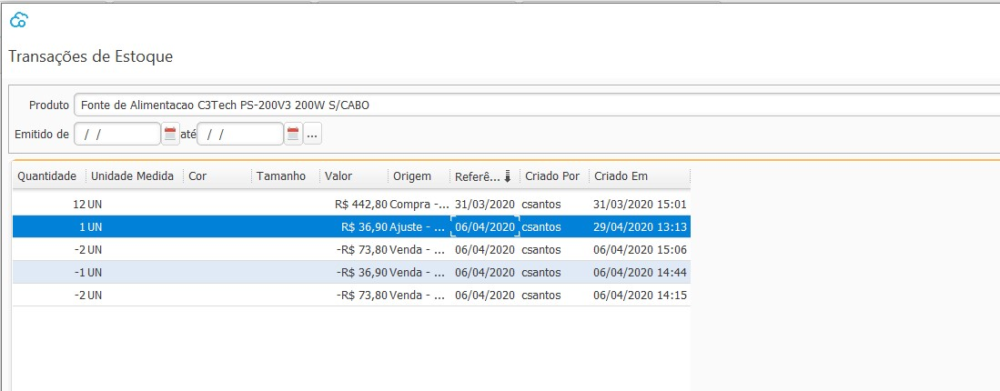

[Início](index.md) / [Estoque](estoque.md) / Transações de Estoque

{: #transacoesestoque}

### Transações de Estoque

Nesta tela é possível consultar as transações de estoque por produto e por período. 

As transações negativas representam saída de estoque.  

A coluna Valor representa o valor total da transação, para todos os itens. 

Referência é a data que representa a movimentação, é a data que a transação foi contabilizada.

[Voltar](estoque.md#estoque)

