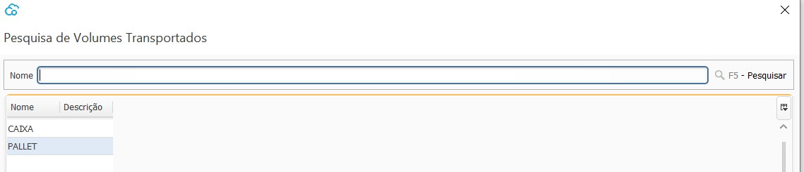
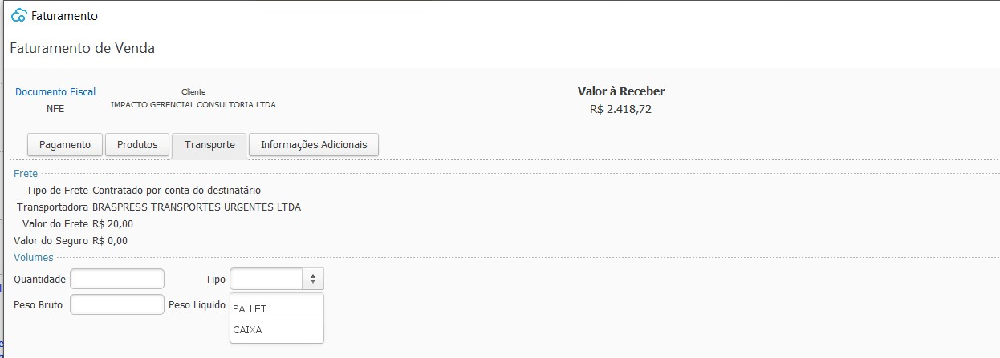

{: #volumes}

### Volumes

Nesta tela deve ser cadastrados os Tipos de Volumes utilizados para transporte de mercadoria.

Quando houver frete, no faturamento deve ser indicado qual o tipo de volume que será utilizado no transporte.

[Voltar](estoque.md#estoque)

