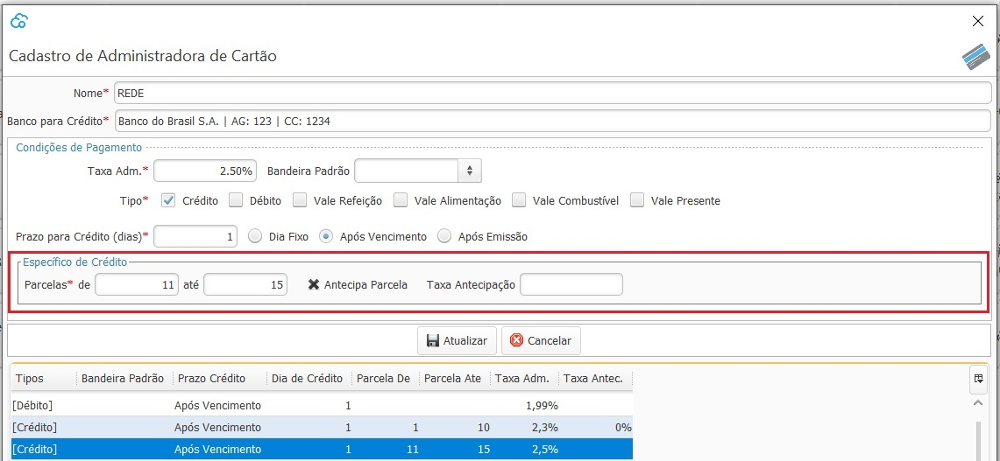

### Administradora de Cartão

Nesta tela devem ser cadastradas todas as operadoras de cartão com que a empresa trabalha bem como as taxas acordadas que serão utilizadas para o cálculo do valor líquido a receber na conciliação de recebimento de cartão.

Podem ser cadastradas várias parametrizações de taxas por Operadora.

Por exemplo: pode ser cadastrada uma taxa para compras recebidas no débito:

e quando a parametrização for Tipo crédito, abrirá alguns campos específicos para essa modalidade, onde pode ser parametrizado uma taxa para um determinado número de parcelas:

e uma taxa diferente para outro número de parcelas

No caso de antecipação de recebimento também existe uma parametrização específica. 

Deve ser informado que será antecipado o recebimento, e se houver, a taxa de antecipação. 

Também deve ser informado o prazo para o recebimento, que no caso abaixo é de um dia após a emissão, ou seja, uma dia após a venda.

Caso não haja antecipação, o prazo será 1 dia após o vencimento de cada parcela.

[Voltar](financeiro.md#financeirocontasreceber)

