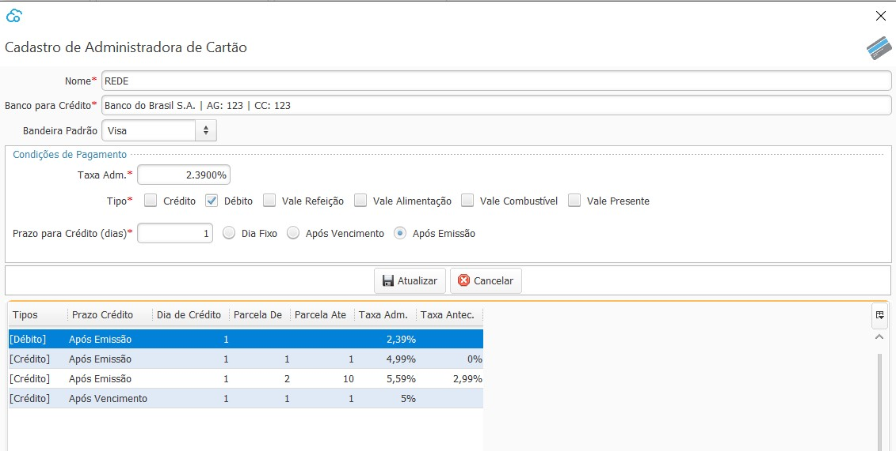

{: #administradoradecartao}

### Administradora de Cartão

{: #cadastro}

#### Cadastro

Nesta tela devem ser cadastradas todas as operadoras de cartão com que a empresa trabalha bem como as taxas acordadas que serão utilizadas para o cálculo do valor líquido a receber na conciliação de recebimento de cartão.

Podem ser cadastradas várias parametrizações de taxas por Operadora.

Por exemplo: pode ser cadastrada uma taxa para compras recebidas no débito:

e quando a parametrização for Tipo crédito, abrirá alguns campos específicos para essa modalidade, onde pode ser parametrizado uma taxa para crédito à vista (1 parcela) ou por um determinado número de parcelas:

e uma taxa diferente para outro número de parcelas

No caso de antecipação de recebimento também existe uma parametrização específica. 

Deve ser informado que será antecipado o recebimento, e se houver, a taxa de antecipação. 

Também deve ser informado o prazo para o recebimento, que no caso abaixo é de um dia após a emissão, ou seja, uma dia após a venda.

Caso não haja antecipação, o prazo será 1 dia após o vencimento de cada parcela.

{: #recebimento}

#### Recebimento

Com botão inverso do mouse em  ou no botão `Mais` no lado inferior direito da tela, ou ainda através dos atalhos  `Ctrl+R` é possível acessar a tela para Recebimento de Cartão.

Na parte superior da tela estão disponíveis os filtros a serem aplicados para a busca das parcelas:

##### Filtros:

*Status:* Aberto: Parcelas que ainda não foram recebidas é o filtro default na abertura da tela.

​             Liquidado: Parcelas que já foram recebidas.

​              Cancelado: Quando a Venda que originou a parcela foi Cancelada.

*Emitido*: Data de lançamento informada na Compra que originou as parcelas.

*Vencendo:* Data calculada pelo sistema, para transações no débito e vouchers o vencimento  é o mesmo dia da emissão. Para transações no crédito o vencimento é de 30 em 30 dias, 30, 60, 90, 120 assim por diante.

*Crédito:* Data calculada pelo sistema, através dos parâmetros de prazo para crédito no [cadastro da administradora de cartão](financeiro_administradora_cartao.md#cadastro).

Com botão inverso do mouse em cima das parcelas,  ou no botão `Mais` no lado inferior direito da tela, ou ainda através dos atalhos  `Ctrl+E` e `Ctrl+R` é possível acessar os menus Editar, e Receber.

{: #editar}

##### Editar

Nesta tela pode-se alterar a data de vencimento e data de crédito ou ainda o  valor calculado da taxa administrativa ou da taxa de antecipação.

Quando forem alterados os valores das taxas, o sistema fará no recebimento do cartão a contabilização da diferença entre o valor de taxas que estava calculado, que já havia sido contabilizado na venda, e o valor que foi alterado de acordo com as contas parametrizadas nos [parâmetros contábeis](contabilidade_parametro_contabil_contas_receber.md).

{: #receber}

##### Receber

Nesta tela é informado o valor líquido que será recebido e também a conta que será feito o crédito do valor. A Data do recebimento deverá ser informada manualmente, esta é a data da movimentação no banco.

Ao clicar em receber o valor será gerada uma transação de entrada no banco:

[Voltar](financeiro.md#financeirocontasreceber)

