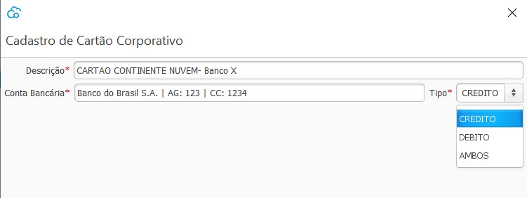
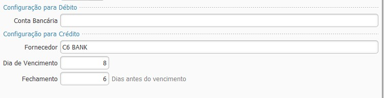
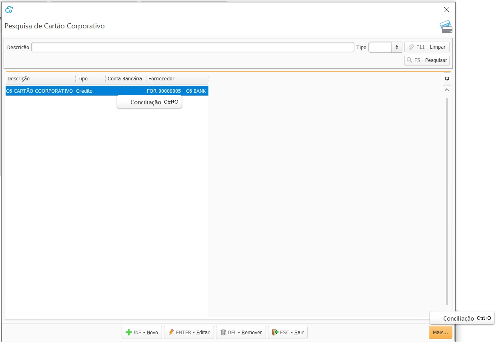
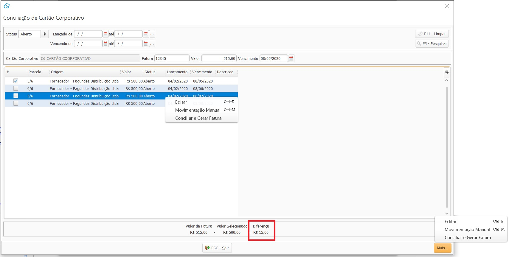
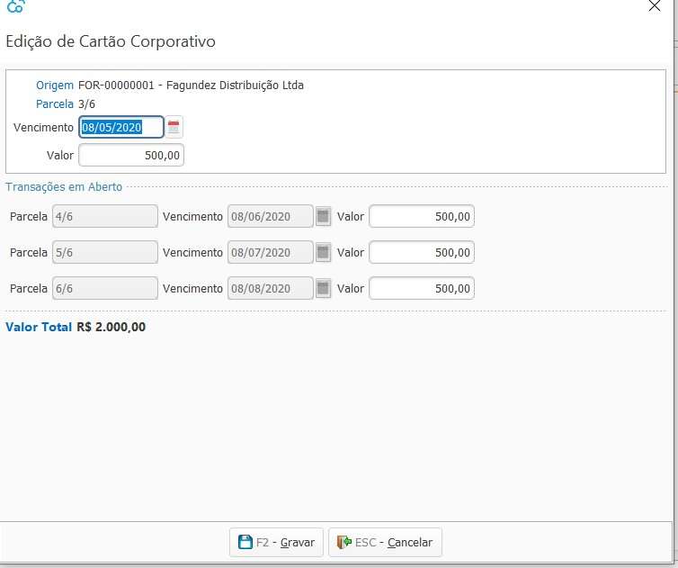
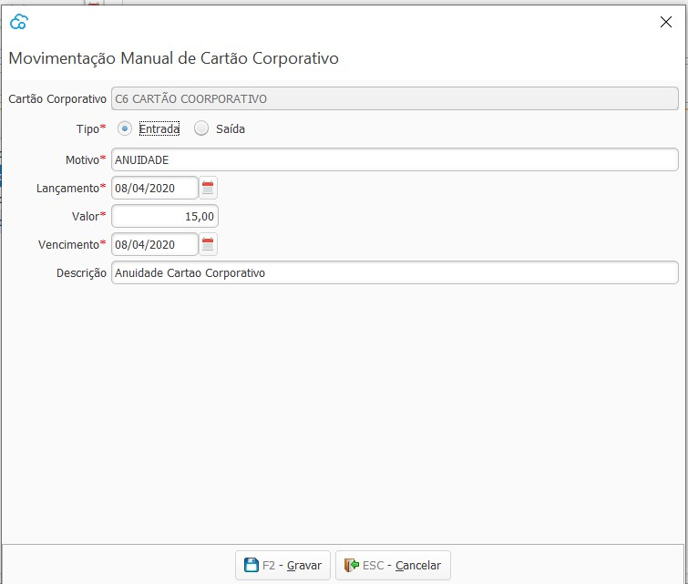
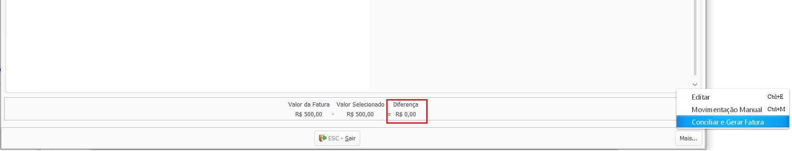
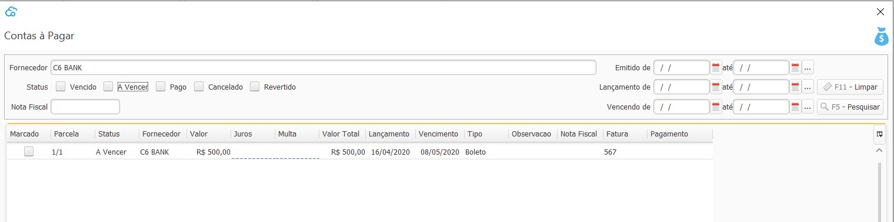
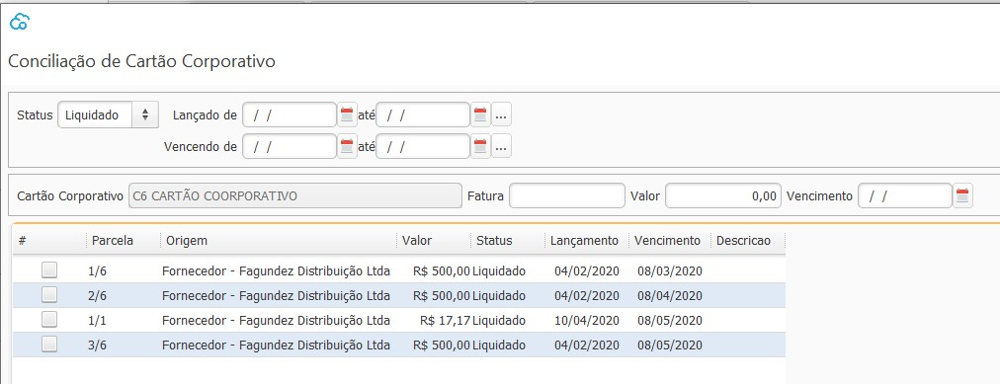

[Início](index.md) / [Financeiro](financeiro.md) /  [Contas à Pagar](financeiro.md#financeirocontaspagar) / Cartão Corporativo

{: #cartaocorporativo}

### Cartão Corporativo

{: #cadastro}

#### Cadastro de Cartão Corporativo

Nesta tela devem ser cadastradas todos os Cartões de Crédito e\ou Débito que a empresa tem e utiliza.

Quando o cartão tiver a opção débito a conta bancária onde será feita a movimentação deverá ser parametrizada.

Quando o cartão tiver a opção crédito um fornecedor deverá ser informado. Esse fornecedor será utilizado para gerar a fatura a após a [conciliação do cartão corporativo](financeiro_cartao_corporativo.md#conciliacao). As data de Vencimento e Fechamento também devem ser informadas, e será com base nestas informações que o sistema irá delimitar o vencimento de cada transação faturada no cartão corporativo.

*Exemplo*: Com base nas configurações abaixo, se uma compra é faturada no dia 1º, o vencimento dessa transação será na fatura que vence no próximo dia 08.  Se uma compra é faturada dia 3 o vencimento dessa transação será na fatura que vence no dia 8 do mês subsequente

{: #conciliacao}

#### Conciliação de Cartão Corporativo

Com botão inverso do mouse em cima do cartão,  ou no botão `Mais` no lado inferior direito da tela, ou ainda através dos atalhos  `Ctrl+O` é possível acessar a tela para conciliação da fatura de cartão corporativo.

Na parte superior da tela estão disponíveis os filtros a serem aplicados para a busca das parcelas:

##### Filtros:

*Status:* Aberto: Parcelas que ainda não foram conciliadas. Esse é o filtro default na abertura da tela.

​             Liquidado: Parcelas que já foram conciliadas e já fazem parte de uma fatura no Contas a Pagar para o Fornecedor amarrado ao Cartão Corporativo.

​              Cancelado: Quando a Compra que originou a parcela foi revertida.

*Vencendo:* Data calculada pelo sistema, através dos parâmetros de vencimento informado no cadastro do cartão corporativo.

*Lançado*: Data de lançamento informada na Compra que originou as parcelas.

##### Dados da Fatura

Esses são os dados Fatura que está sendo conciliada. Devem ser inseridos manualmente:

*Fatura:*  é esse número que vai aparecer no Contas a Pagar.

*Valor:*  é com base neste valor que o sistema vai apontar as diferenças no canto inferior da tela.

*Vencimento:*   é essa data de vencimento que vai aparecer no Contas a Pagar.

Com botão inverso do mouse em cima das parcelas,  ou no botão `Mais` no lado inferior direito da tela, ou ainda através dos atalhos  `Ctrl+E` e `Ctrl+M` é possível acessar os menus Editar, Movimentação Manual e Conciliar e Gerar Fatura.

{: #editar}

##### Edição de Cartão Corporativo

Nesta tela pode-se alterar o vencimento ou valor de uma parcela específica, ou o valor de várias parcelas de um mesmo parcelamento, desde que não altere o somatório total final.

{: #movimentacaomanual}

##### Movimentação Manual de Cartão Corporativo

Nesta tela pode-se incluir transações  que estão na Fatura da cartão corporativo mas não são decorrentes do lançamento de uma compra. Como por exemplo uma taxa de anuidade do cartão, Juros, ou algum desconto. Ao clicar em gravar a transação irá aparecer como uma parcela na tela de conciliação do cartão corporativo. Esses valores serão contabilizados de acordo com as contas contábeis informadas no [cadastro de motivo de movimentação manual de cartão corporativo](financeiro_motivo_movimentacao_manual_cartao.md).

{: #conciliaregerarfatura}

##### Conciliar e Gerar fatura

Quando não houver mais diferença entre o valor da fatura informado e o valor das parcelas selecionadas a Conciliação poderá ser feita. 

Ao clicar em Conciliar e Gerar Fatura a fatura será gerada no Contas a Pagar do fornecedor que foi parametrizado no [cadastro do cartão corporativo](financeiro_cartao_corporativo.md#cadastro).

e as parcelas que foram selecionadas na conciliação da fatura ficam com status Liquidado.

[Voltar](financeiro.md#financeirocontaspagar)

