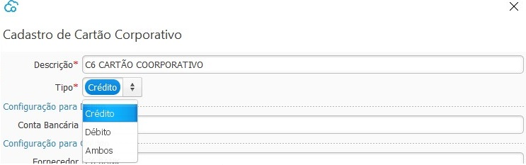

### Cartão Corporativo

Nesta tela devem ser cadastradas todos os Cartões de Crédito e\ou Débito que a empresa tem e utiliza.

A Conta Bancária utilizada não necessáriamente deve ser vinculada ao cartão, mas deve ser parametrizada a conta bancária que se normalmente faz-se o pagamento da Fatura do Cartão.

Nos casos de Cartão de Débito será a conta bancária de onde ocorrerá os débitos.

[Voltar](financeiro.md#financeirocontaspagar)

