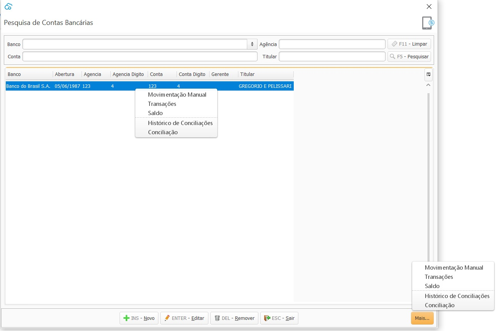
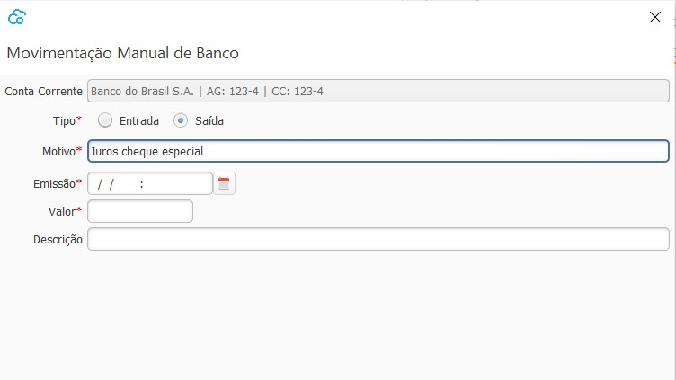
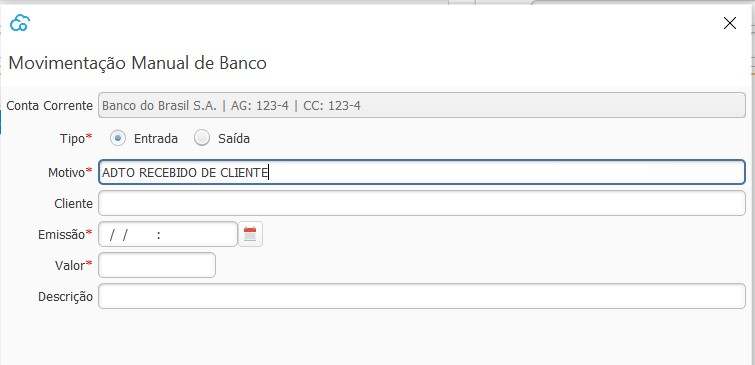
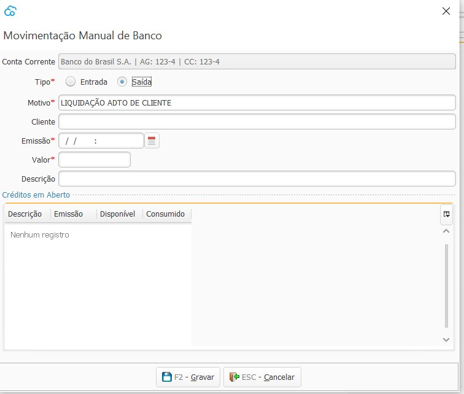
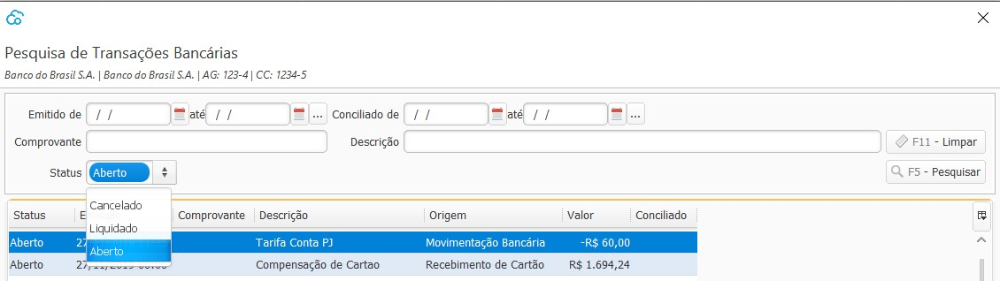
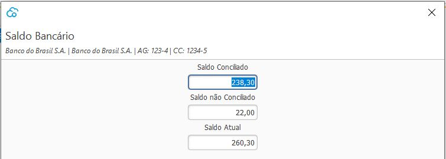
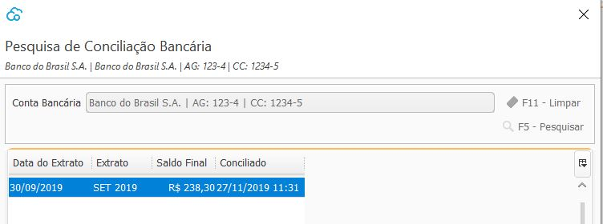
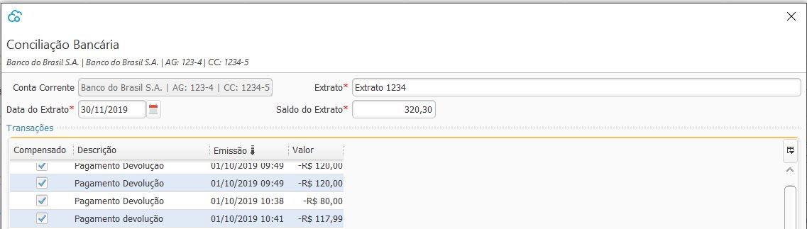
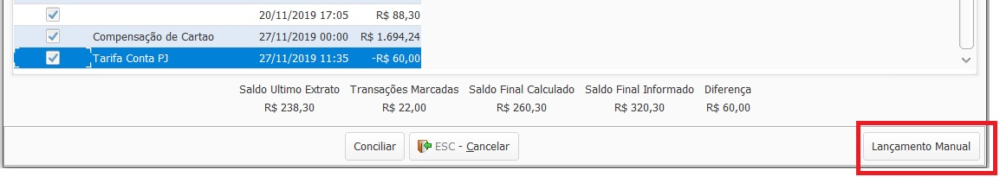

### Conta Bancária

{: #contabancaria}

Nesta tela devem ser cadastradas todas as Contas bancárias que a empresa tem e movimenta.

Clicando com botão inverso do mouse em cima da conta,  ou no botão `Mais` no lado inferior direito da tela, as seguintes opções ficam disponíveis:

#### Movimentação Manual
{: #movimentacaomanual}

Nesta podem ser inseridas todas as movimentações de entrada e saída das contas bancárias que forem além das já feitas nos outros processos do sistema, como por exemplo uma saída devido há uma tarifa bancária, ou uma entrada referente há um adiantamento de Cliente.

Emissão é a data que a transação aparecerá no banco e também a data de contabilização.

Os motivos devem ser previamente cadastrados no Cadastro de [Motivo de Movimentação Manual de Banco](financeiro_motivo_movimentacao_manual_banco.md#cadastro).

Alguns campos só aparecem de acordo com o motivo informado, por exemplo o campo Cliente ou Fornecedor só aparece se o motivo for parametrizado para [Gerar crédito para o cliente\fornecedor](financeiro_motivo_movimentacao_manual_banco.md#gerarcredito).

Os campos de Créditos em aberto só aparecem se o motivo for parametrizado para [Liquidar crédito para o cliente\fornecedor](financeiro_motivo_movimentacao_manual_banco.md#liquidarcredito).

#### Transações
{: #transacoes}

Esta é uma tela de consulta, onde estão disponíveis todas as transações bancárias realizadas.

O Status Aberto representa as transações que ainda não foram Conciliadas. 

O Status Liquidado representa as transações que já foram Conciliadas, o histórico da Conciliação podem ser visualizado no menu [Histórico Conciliação](financeiro_conta_bancaria.md#historicoconciliacao)

O Status Cancelado representa as transações que foram canceladas através dos processos de [Cancelamento de Venda](venda_cancelamento.md) ou [Reversão de Recebimento](financeiro_contas_receber.md#reversao) 

#### Saldo
{: #saldo}

Esta é uma tela de consulta, onde está disponível o Saldo bancário registrado no sistema

#### Histórico Conciliação
{: #historicoconciliacao}

Esta é uma tela de consulta, onde está disponível o histórico das Conciliações bancárias realizadas.

#### Conciliação
{: #conciliacao}

Nesta tela é feito o processo de conciliação bancária.

Na grade são listadas todas as transações bancárias realizadas com status aberto, ou seja que ainda não foram conciliadas.

No Campo `Extrato` deve se informar uma identificação para o extrato bancário, pode ser um número ou uma descrição. Nos campos `Data do Extrato` e `Saldo do Extrato` devem ser informadas as informações conforme descrito no extrato bancário.

Ao selecionar as transações o sistema informa na parte inferior da tela os valores informados, como saldo inicial, as transações selecionadas e se há diferença de valores.

Caso necessário, pode-se incluir nesta mesma tela os lançamentos Manuais de Caixa. 

Não havendo diferenças o Extrato pode ser conciliado.

[Voltar](financeiro.md#financeirobanco)

