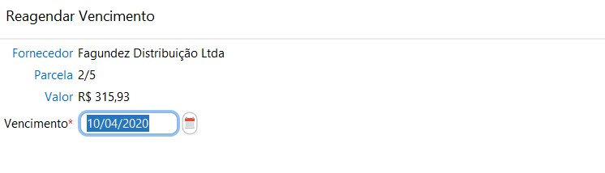
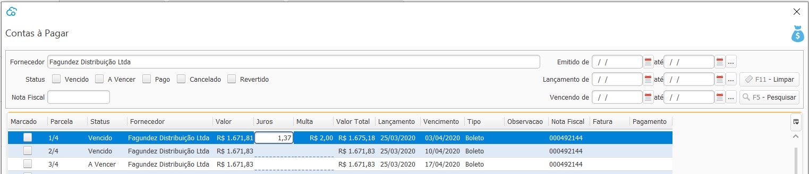
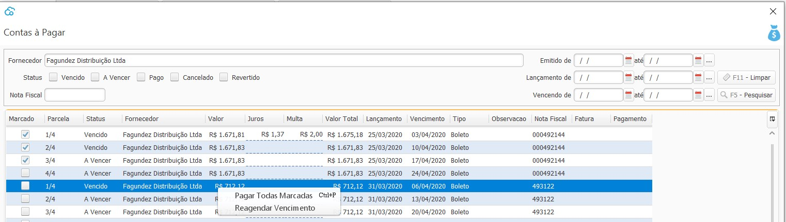
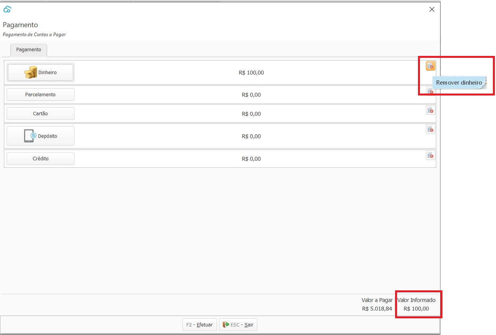
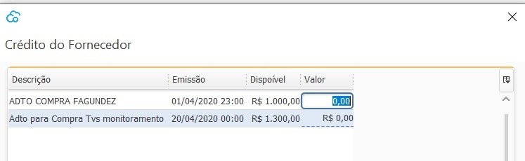

{: #contaspagar}

### Contas à Pagar

Nesta tela estão disponíveis as parcelas à pagar que foram faturadas como [parcelamento](compras_compra.md#faturamento).

Status: Cancelado: Quando a compra que originou a parcela foi [revertida](compras_compra.md#reversao).

​    

{: #reagendarvencimento}

#### Reagendar vencimento

Clicando com botão inverso em cima da parcela,  ou no botão `Mais`  pode-se reagendar o vencimento da fatura.

{: #jurosemulta}

#### Juros e Multa

O juros e multa **não** são calculados pelo sistema, quando necessário podem ser inclusos clicando diretamente no campo específico na linha na grade. Esses  valores de juros e multa são salvos temporariamente, apenas para que seja feito o pagamento da parcela, assim que a tela do Contas à Pagar for fechado e reaberto os valores são zerarados.

Esses valores serão contabilizados conforme conta contábil parametrizada nos [parâmetros contábeis](contabilidade_parametro_contabil_contas_pagar.md#contaspagar).

{: #pagamento}

#### Pagamento

Clicando com botão inverso,  ou no botão `Mais` no lado inferior direito da tela, ou ainda através dos atalhos  `Ctrl+P` pode-se fazer o pagamento das parcelas selecionadas.

Os valores informados são sumarizados nos totalizadores no final da tela.  Os valores informados podem ser removidos através do botão Remover no final de cada condição de pagamento.

*Dinheiro:* Esta forma de pagamento só fica disponível se houver um Caixa aberto para o usuário que está fazendo o pagamento e se no cadastro do caixa estiver parametrizado para fazer pagamento em Dinheiro.

*Parcelamento*:  O valor faturado como parcelamento será levado para o [Contas a Pagar](financeiro_contas_pagar.md#contaspagar).

*Cartão:* O valor faturado como Cartão de Débito será lançado como uma saída diretamente na conta bancária amarrada ao [cadastro de cartão corporativo](financeiro_cartao_corporativo.md#cadastro).

​             O valor faturado como Cartão de Crédito será lançado como transações na [conciliação de Cartão Corporativo](financeiro_cartao_corporativo.md#conciliacao).

*Depósito:* O valor faturado como depósito será lançado como uma saída diretamente na conta bancária informada.

*Crédito:* Somente poderá ser faturado como crédito, se houver crédito disponível para o Fornecedor. Neste caso o faturamento faz o abatimento do crédito.

Após o faturamento o histórico de abatimentos e saldo de crédito para o fornecedor pode ser visto diretamente no [menu crédito no cadastro do fornecedor](compras_fornecedor.md#credito).

[Voltar](financeiro.md#financeirocontaspagar)

