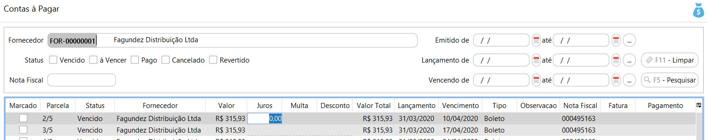

[Início](index.md) / [Financeiro](financeiro.md) / Contas à Pagar

{: #contaspagar}

Contas à Pagar

Pesquisa

Nesta tela estão disponíveis as parcelas à pagar decorrentes do faturamentos como [parcelamento](compras_compra.md#faturamento).

Status

- À vencer: Parcela que está em aberto dentro do prazo de vencimento.
- Vencido: Parcela que está em aberto e já passou o vencimento.
- Pago: Parcela que já foi paga ou liquidada.
- Cancelado: Quando a compra que originou a parcela foi revertida.
- Revertido: Parcelas que foram pagas e depois o pagamento foi revertido. Ao reverter o pagamento o sistema atualiza o status que antes estava Pago para Revertido e gera um novo título em aberto igual ao original.

{: #jurosemulta}

Juros e Multa

O juros e multa **não** são calculados pelo sistema, quando necessário podem ser inclusos clicando diretamente no campo específico na linha na grade. Esses  valores de juros e multa são salvos temporariamente, apenas para que seja feito o pagamento da parcela, assim que a tela do Contas à Pagar for fechada e reaberta os valores são zerados.

Esses valores serão contabilizados conforme conta contábil parametrizada nos [parâmetros contábeis](contabilidade_parametro_contabil_contas_pagar.md#contaspagar).

##### 

   {: #desconto}

##### Desconto

Quando necessário, o valor de desconto obtido, pode ser incluso clicando diretamente no campo específico na linha na grade. Esse valor de desconto, assim como os valores de juros e multa, e salvo temporariamente, apenas para que seja feito o pagamento da parcela, assim que a tela do Contas à Pagar for fechada e reaberta os valores são zerados.

Esses valores serão contabilizados conforme conta contábil parametrizada nos [parâmetros contábeis](contabilidade_parametro_contabil_contas_pagar.md#contaspagar).

### Mais 

Através do botão `Mais` ou com o botão inverso do mouse se acessa todos os processos relacionados ao Contas à Pagar e também a impressão dos Tickets e relatórios.

##### Processos

[Reagendar Vencimento](financeiro_contas_pagar.md#reagendarvencimento) é habilitado somente se selecionado uma parcela com status À vencer ou vencido.
[Pagar todas as marcadas](financeiro_contas_pagar.md#pagamento) é habilitado somente se marcado uma parcela com status À vencer ou vencido.

[Reverter Pagamento](financeiro_contas_pagar.md#reverterpagamento) é habilitado somente se marcado uma parcela com status Pago.

##### Relatórios

[Contas à Pagar e Pagos](financeiro_contas_pagar.md#contaspagarepagos) é um relatório que detalha todas as parcelas, tanto as em aberto quanto as já liquidadas.

### Processos

{: #reagendarvencimento}

#### Reagendar vencimento

A alteração do vencimento é feito por parcela de maneira definitiva, ao alterar a data de vencimento o sistema irá gravar essa nova data.

{: #pagamento}

#### Pagar todas as marcadas

O valor das parcelas selecionadas é sumarizado nos totalizadores no final da tela.  Os valores informados por condição de pagamento podem ser removidos através do botão Remover no final de cada condição de pagamento.

*Dinheiro:* Esta forma de pagamento só fica disponível se houver um Caixa aberto para o usuário que está fazendo o pagamento e se no cadastro do caixa estiver parametrizado para fazer pagamento em Dinheiro.

{: #formaspagamento}

##### Formas de Pagamento

*Parcelamento*:  O valor faturado como parcelamento será levado para o [Contas a Pagar](financeiro_contas_pagar.md#contaspagar).

*Cartão:* O valor faturado como Cartão de Débito será lançado como uma saída diretamente na conta bancária amarrada ao [cadastro de cartão corporativo](financeiro_cartao_corporativo.md#cadastro). 
              O valor faturado como Cartão de Crédito será lançado como transações na [conciliação de Cartão Corporativo](financeiro_cartao_corporativo.md#conciliacao).

*Depósito:* O valor faturado como depósito será lançado como uma saída diretamente na conta bancária informada.

*Crédito:* Somente poderá ser faturado como crédito, se houver crédito disponível para o Fornecedor. Neste caso o faturamento faz o abatimento do crédito.

Após o faturamento o histórico de abatimentos e saldo de crédito para o fornecedor pode ser visto diretamente no [menu crédito no cadastro do fornecedor](compras_fornecedor.md#credito).

{: #reverterpagamento}

#### Reverter Pagamento

Nesta tela  é possível fazer a reversão de um recebimento. O processo faz a reversão financeira e contábil do pagamento, basta informar o motivo da reversão. Esse motivo é utilizado como histórico no comprovante contábil.

As parcelas serão revertidas conforme o pagamento, ou seja, se foram pagas duas parcelas juntas, as duas serão revertidas. Ao reverter o pagamento o sistema atualiza o status que antes estava Pago para Revertido e gera um novo título em aberto igual ao original

#### Relatórios

#### Contas à Pagar e Pagos

Neste relatório podem ser filtradas todas as parcelas à pagar e pagas. Antes da emissão do relatório é possível inserir uma série de filtros que o ajudarão no gerenciamento das informações.

[Voltar](financeiro.md#financeirocontaspagar)

