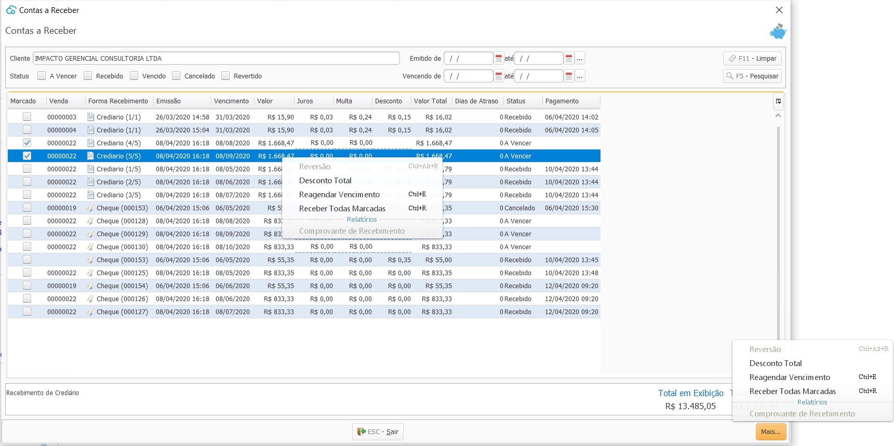
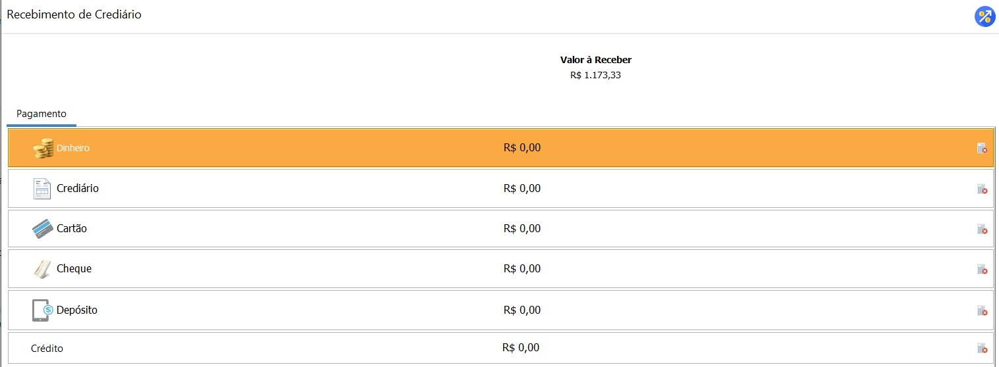
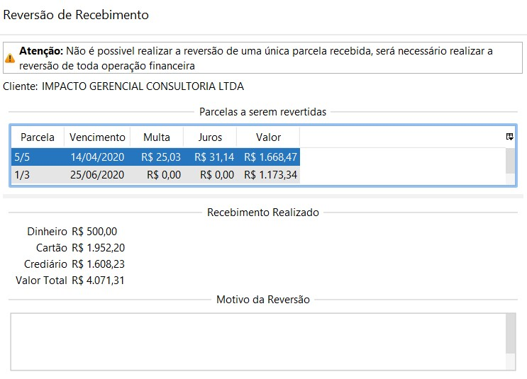
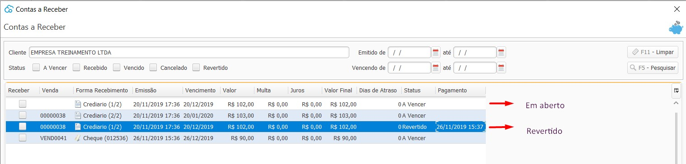

### Contas a Receber

Nesta tela estão disponíveis as parcelas a Receber que foram faturadas como crediário ou cheque.

Clicando com botão direito em cima da parcela,  ou no botão Mais no lado inferior direito da tela, ou ainda através dos atalhos  `Ctrl+E` `Ctrl+R` ou `Ctrl+Alt+R` as opões de trabalho, `Editar`, `Receber` ou `Reversão` ficarão disponíveis

- Editar

Na edição é possível alterar o vencimento de uma parcela e o valor do juros e multa. 

Uma vez alterado o vencimento, essa nova informação será salva. O Valor do Juros e Multa serão salvos temporareamente, assim que o Contas a Receber for fechado e reaberto o valor do juros e multa serão novamente calculados através dos percentuais informados nos [Ajustes Contas a Receber](ajustes_contas_receber.md)

- Receber

  O processo de recebimento no contas a Receber é similar ao faturamento, basta informar a(s) forma(s) de pagamento e faturar. 

  A opção dinheiro só estará disponível se o usuário estiver com algum Caixa aberto.

  

  

- *Reversão*{: #reversao}

  Para as parcelas já recebidas, a opção Reversão estará disponível e fará a reversão financeira e contábil do recebimento, basta informar o motivo da reversão. Esse motivo será utilizado como histórico contábil.

  ]

  

  Ao reverter o recebimento o sistema irá atualizar o status que antes estava Recebido para Revertido e irá gerar um novo título em aberto igual ao original.

  

[Voltar](financeiro.md)

