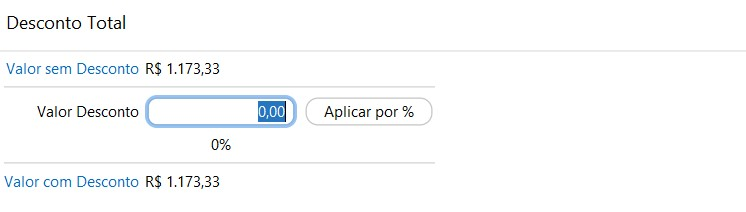

{: #contasreceber}

### Contas à Receber

Nesta tela estão disponíveis as parcelas a Receber que foram faturadas como crediário ou cheque.

*Status:* Cancelado: Parcelas oriundas de Vendas que foram canceladas.

​             Revertido: Parcelas que foram recebidas e depois o recebimento foi revertido. Ao reverter o recebimento o sistema atualiza o status que antes estava Recebido para Revertido e gera um novo título em aberto igual ao original.

Os valores de juros e multa são calculados pelo sistema através das alíquotas parametrizadas nos [ajustes de Contas à Receber](sistema_ajustes_contas_receber.md#contasreceber), mas podem ser editados manualmente  ao clicar nos próprios campos em cada parcela. O valor de desconto também pode ser alterado manualmente em cada parcela ou através do menu [Desconto Total](financeiro_contas_receber.md#descontototal).

Se editados, os valores de juros, multa e desconto são salvos temporariamente, apenas para que seja feito o recebimento, assim que a tela de Contas a Receber for fechado e reaberto, nas parcelas em aberto o valor do juros e multa são novamente calculados  e o desconto é zerado.

Clicando com botão inverso do mouse em cima da parcela,  ou no botão `Mais` no lado inferior direito da tela, alguma opções de acesso estarão disponíveis.

**Para parcelas em aberto,** que são as com status Vencido ou À vencer, as seguintes opções estão disponíveis:

{: #descontototal}

#### Desconto Total

Nesta tela é possível informar um valor único de desconto que o sistema fará o rateio proporcionalmente para cada parcela selecionada. O desconto pode ser informado em valor ou em percentual.

{: #reagendarvencimento}

#### Reagendar Vencimento

Nesta tela  é possível alterar o vencimento de uma parcela.

Uma vez alterado o vencimento, essa nova informação é salva permanentemente.

{: #receber}

#### Receber

O processo de recebimento no contas a Receber é similar ao faturamento, basta informar a(s) forma(s) de pagamento e faturar. 

Ver o detalhamento do faturamento por Forma de Recebimento [Aqui](venda.md#formasrecebimento).

A opção dinheiro só fica disponível se o usuário estiver com algum Caixa aberto.

**Para parcelas recebidas**, as seguintes opções estão disponíveis:

{: #reversao}

#### Reversão

Nesta tela  é possível fazer a reversão de um recebimento. O processo faz a reversão financeira e contábil do recebimento, basta informar o motivo da reversão. Esse motivo é utilizado como histórico no comprovante contábil.

Se duas parcelas foram recebidas juntas, as duas são revertidas.

]

Ao reverter o recebimento o sistema atualiza o status que antes estava Recebido para Revertido e gera um novo título em aberto igual ao original.

{: #comprovante}

#### Comprovante de Recebimento

Nesta tela  é possível imprimir o comprovante do recebimento. O formato do comprovante é para impressão em bobina de 80mm e o logo é parametrizável no cadastro da [Empresa](administracao_empresa.md#logo).

[Voltar](financeiro.md#financeirocontasreceber)

