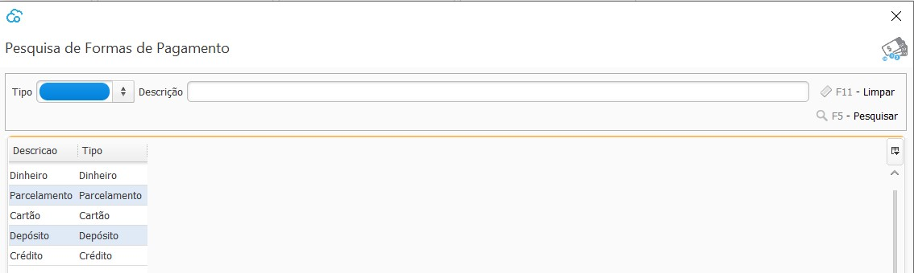

[Início](index.md) / [Financeiro](financeiro.md) /  [Contas à Pagar](financeiro.md#financeirocontaspagar) / Forma de Pagamento

{: #cadastro}

### Forma de Pagamento

Nesta tela estão disponíveis todas as formas de pagamento disponíveis no sistema. Elas já vem pré-cadastradas com a instalação do sistema.

Para que um caixa possa fazer pagamentos em dinheiro, no cadastro do caixa deve estar habilitado a forma de Pagamento Dinheiro.

[Voltar](financeiro.md#financeirocontaspagar)

