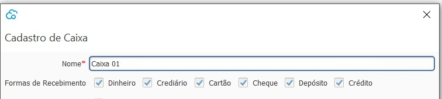

[Início](index.md) / [Financeiro](financeiro.md) /  [Contas à Receber](financeiro.md#financeirocontasreceber) / Formas de Recebimento

{: #cadastro}

### Formas de Recebimento

Nesta tela estão disponíveis todas as formas de recebimento disponíveis no sistema. Elas já vem pré-cadastradas com a instalação do sistema.

As formas que serão utilizadas pela empresa devem ser marcadas no [Cadastro de Caixa](caixa_cadastro_caixa.md), possibilitando assim que diferentes caixas trabalhem com diferentes formas de recebimento.

[Voltar](financeiro.md#financeirocontasreceber)

