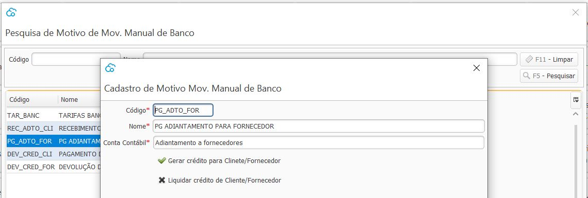

### Motivo Movimentação Manual de Banco

Nesta tela devem ser cadastrados todos os Motivos das movimentações de entrada e saída das contas bancárias que forem além das já feitas nos outros processos do sistema.

Como por exemplo uma saída devido há uma tarifa bancária, ou uma entrada referente há um adiantamento de Cliente. 

Cada motivo deve ser amarrado há uma conta contábil e essa conta é usada no lançamento contábil da transação de movimentação manual de Banco.

#### Gerar crédito para Cliente/Fornecedor

Essa opção deve ser marcada quando a movimentação irá gerar um crédito para o Clliente ou Fornecedor.

Como por exemplo, quando um cliente faz um pagamento antecipado ou quando é feito um pagamento antecipado para um fornecedor. 

#### Liquidar crédito de Cliente/Fornecedor

Essa opção deve ser marcada quando a movimentação irá liquidar um crédito já existente do Cliente ou Fornecedor.

Como por exemplo,  se for pago uma devolução de Cliente, ou se ao fornecedor devolveu o dinheiro da antecipação.

[Voltar](financeiro.md)

