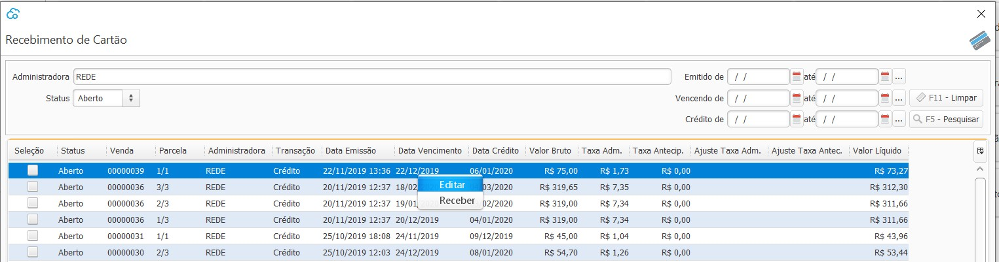
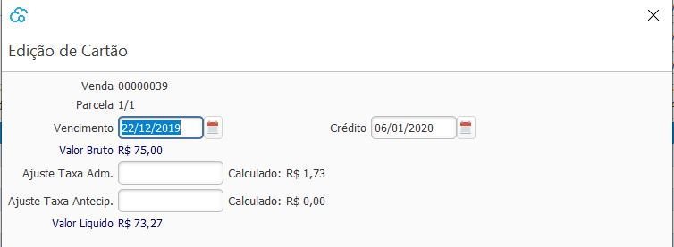
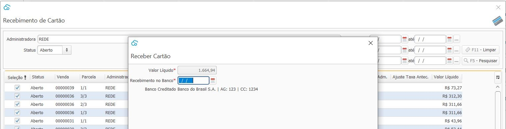
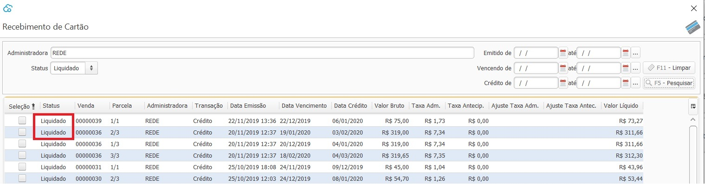
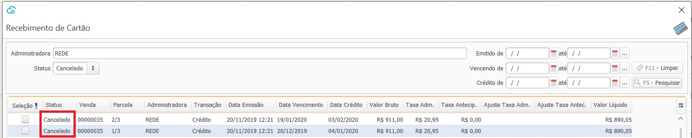

### Recebimento de Cartão

Nesta tela será feito o processo de conciliação de recebimento de cartão.

Serão listadas todas as parcelas decorrentes de Venda em Cartão para cada Administradora  cadastrada.

O sistema fará o calculo das taxas e do valor liquido a receber através dos percentuais parametrizados no cadastro de [Administradora de Cartão](financeiro_administradora_cartao.md).

Caso necessário os valores calculados poderão ser alterados, clicanco com o botão direito `Editar`.

- Editar

Uma vez alterado o vencimento, essa nova informação será salva. O Valor do Juros e Multa serão salvos temporareamente, assim que o Recebimento de Cartão for fechado e reaberto o valor do juros e multa serão novamente calculados através dos percentuais informados cadastro de [Administradora de Cartão](financeiro_administradora_cartao.md).

- Receber

Ao selecionar as parcelas que serão recebidas o sistema informará o valor liquido. 

Deve-se informar a data que o valor entrará, ou entrou, efetuvamente na Conta Bancária e clicar em receber. 

 Após o recebimento as parcelas constarão com status `Liquidado` e o valor recebido entrará em uma transação na [Conta Bancária](financeiro_conta_bancaria.md)

- Transações Canceladas

  Nos casos de Cancelamento de Venda ou [Reversão de Recebimento](financeiro_contas_receber.md#reversao) o status das parcelas recebidas via cartão ficarão como `Cancelado` e essas transações não podem ser recebidas.

[Voltar](financeiro.md)

