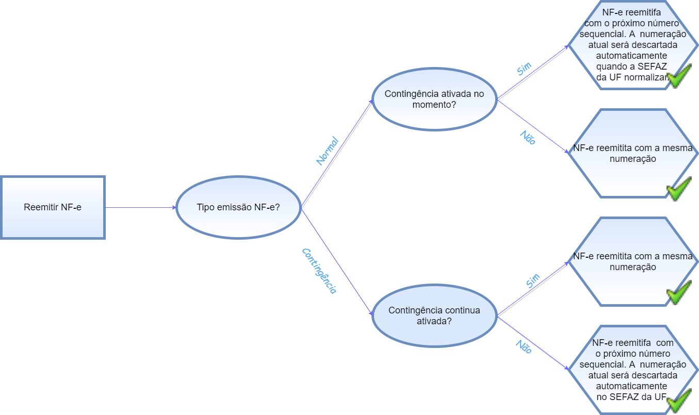

[Início](index.md) / [Gestão Fiscal](gestao_fiscal.md) / Gestão de Documentos Fiscais

### Gestão de Documentos Fiscais

{: #pesquisadocumentosfiscais}

#### Pesquisa de Documentos Fiscais

Nesta tela consta a relação de todos os documentos fiscais emitidos e recebidos pela empresa.

Através do botão `Mais` ou com o botão inverso do mouse se acessa todos os outros processos relacionados ao documento fiscal e também a impressão dos DANFES e relatórios.

###### Status

- Aprovado - Documento fiscal eletrônico emitido pela empresa e aprovado pela SEFAZ. *Uma exceção para os documentos tipo NFC-e emitidos em contingência Off-line que tem o Status Aprovado antes de serem enviados ao SEFAZ*
- Rejeitado - Documento fiscal eletrônico emitido pela empresa e rejeitado pela SEFAZ. Esses documentos devem ser corrigidos e reemitidos ou a venda de origem Cancelada.
- Cancelado - Documento fiscal eletrônico emitido, aprovado e cancelado na SEFAZ.
- Descartado - Numeração inutilizada na SEFAZ através dos processos de cancelamento de venda ou remissão.
- Lançado - Documento fiscal emitido por terceiros e lançado no sistema pelo processo de Compra ou Devolução de Venda. 
- Revertido - Documento fiscal emitido por terceiros e lançado no sistema através do processo de compra e que teve o processo de compra revertido.

###### Status intermediário

- Aguardando descarte- Quando o processo de cancelamento da Venda ou reemissão foi efetuado, faltando apenas a conclusão da comunicação com a SEFAZ. Neste caso deve-se aguardar que o sistema concluirá o processo automaticamente, quando o ambiente estiver normal.
- Aguardando cancelamento - Quando o processo de cancelamento da Venda já foi efetuado, faltando apenas a conclusão da comunicação com a SEFAZ. Neste caso deve-se aguardar que o sistema concluirá o processo automaticamente.

{: #reemissao}

#### Reemissão

O menu para acesso ao processo de Reemissão de documentos fiscais é habilitado somente para os documentos fiscais com status= Rejeitado. 

O processo de reemissão pode ser utilizado para todas as NF-e ou NFC-e emitidas pela empresa, através dos processos de Vendas, Devolução de Vendas ou Devolução de Compras.

##### Quando usar?

O processo de reemissão deve ser utilizado somente quando a rejeição retornada pela SEFAZ for referente há:

- Dados cadastrais do emitende (empresa);
- Dados cadastrais do destinatário (cliente ou fornecedor) ;
- Dados cadastrais do produto (NCM, CEST e unidade de medida);

Nestes casos as informações devem ser corrigidas nos cadastros de origem e o documento fiscal reemitido para o SEFAZ. 

- Indisponibilidade de ambiente.

Neste caso a contingência deve ser ativada ou desativada e o documento fiscal reemitido para o SEFAZ. 

Se a rejeição for referente há alguma inconsistencia na Venda, como impostos, a Venda deverá ser Cancelada.

##### Como usar?

###### NF-e

Quando a reemissão da NF-e for executada no mesmo ambiente de emissão, a numeração da NF-e será mantida e o XML será reenviado para o SEFAZ, sendo alterado apenas as informações que foram corrigidas nos cadastros.

Quando a reemissão da NF-e for executada em ambiente diferente da emissão,  a numeração da NF-e será alterada para o próximo sequencial e o XML será reenviado para o SEFAZ , com as adaptações  necessárias ao novo ambiente, além das informações que foram corrigidas nos cadastros.

*Exemplo*: NF-e 000123 foi emitida  e enviada ao SEFAZ-PR , porém foi rejeitada pois a SEFAZ-PR entrou em contingência. Após a ativação da Contingência a NF-e será reemitida com a numeração 000124 e enviada ao SEFAZ SVC-RS e numeração atual 000123 será inutilizada (descartada) automaticamente pelo sistema no SEFAZ-PR quando a contingência for desativada.

###### NFC-e

Como a contingência Off-line não realiza comunicação com o SEFAZ, ou seja, todos os dados são enviados para o mesmo ambiente, não existe a necessidade de troca de numeração em nenhum processo.

{: #historico}

#### Histórico

Nesta tela estão dispostos em um fluxo cronológico todas as interações com o SEFAZ. 

Ao lado esquerdo estão disponíveis o histórico de eventos e ao lado direito os XMLs de Requisição e Resposta do SEFAZ por evento.

{: #cartacorrecao}

#### Carta de Correção

Para as NF-e com status aprovado no meu `Mais`

{: #cancelamento}

#### Cancelamento

{: #contingencia}

#### Contingência

{: #exportar}

#### Exportar