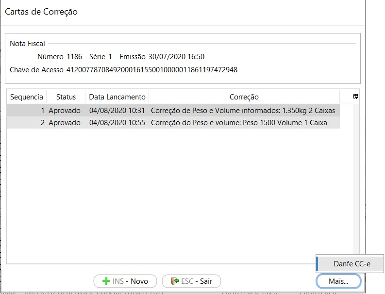

[Início](index.md) / [Gestão Fiscal](gestao_fiscal.md) / Gestão de Documentos Fiscais

##  Gestão de Documentos Fiscais

{: #pesquisadocumentosfiscais}

### Pesquisa de Documentos Fiscais

Nesta tela consta a relação de todos os documentos fiscais emitidos e recebidos pela empresa.

#### Status

- Aprovado - Documento fiscal eletrônico emitido pela empresa e aprovado pela SEFAZ. *Uma exceção para os documentos tipo NFC-e emitidos em contingência Off-line que tem o Status Aprovado antes de serem enviados ao SEFAZ*
- Rejeitado - Documento fiscal eletrônico emitido pela empresa e rejeitado pela SEFAZ. Esses documentos devem ser corrigidos e reemitidos ou a venda de origem Cancelada.
- Cancelado - Documento fiscal eletrônico emitido, aprovado e cancelado na SEFAZ.
- Descartado - Numeração inutilizada na SEFAZ através dos processos de cancelamento de venda ou remissão.
- Lançado - Documento fiscal emitido por terceiros e lançado no sistema pelo processo de Compra ou Devolução de Venda. 
- Revertido - Documento fiscal emitido por terceiros e lançado no sistema através do processo de compra e que teve o processo de compra revertido.

#### Status intermediário

- Aguardando descarte- Quando o processo de cancelamento da Venda ou reemissão foi efetuado, faltando apenas a conclusão da comunicação com a SEFAZ. Neste caso deve-se aguardar que o sistema concluirá o processo automaticamente, quando o ambiente estiver normal.
- Aguardando cancelamento - Quando o processo de cancelamento da Venda já foi efetuado, faltando apenas a conclusão da comunicação com a SEFAZ. Neste caso deve-se aguardar que o sistema concluirá o processo automaticamente.

### Processos

Através do botão `Mais` ou com o botão inverso do mouse se acessa todos os processos relacionados ao documento fiscal e também a impressão dos DANFES e relatórios.

O menu [Reemissão](gestao_fiscal_gestao_dfe.md#reemissao) é habilitado somente se selecionado um documento fiscal com status Rejeitado. 

O menu [Carta de Correção](gestao_fiscal_gestao_dfe.md#cartacorrecao) é habilitado somente se selecionado um documento fiscal modelo 55 (NF-e) com status Rejeitado. 

O menu [Cancelamento](vendas_venda.md#cancelamento) é habilitado somente se selecionado um documento fiscal com status Aprovado

As opções [Histórico](gestao_fiscal_gestao_dfe.md#historico), [Contingência](gestao_fiscal_gestao_dfe.md#contingencia), [Exportar XML](gestao_fiscal_gestao_dfe.md#exportarXML) e [Sincronização](gestao_fiscal_gestao_dfe.md#sincronização) ficam sempre habilitados.

{: #reemissao}

### Reemissão

O processo de reemissão pode ser utilizado para todas as NF-e ou NFC-e emitidas pela empresa, através dos processos de Vendas, Devolução de Vendas ou Devolução de Compras.

#### Quando usar?

O processo de reemissão deve ser utilizado somente quando a rejeição retornada pela SEFAZ for referente há:

- Dados cadastrais do emitende (empresa);
- Dados cadastrais do destinatário (cliente ou fornecedor) ;
- Dados cadastrais do produto (NCM, CEST e unidade de medida);

Nestes casos as informações devem ser corrigidas nos cadastros de origem e o documento fiscal reemitido para o SEFAZ. 

- Indisponibilidade de ambiente.

Neste caso a contingência deve ser ativada ou desativada e o documento fiscal reemitido para o SEFAZ. 

Se a rejeição for referente há alguma inconsistencia na Venda, como impostos, a Venda deverá ser Cancelada.

#### Como usar?

##### NF-e

Quando a reemissão da NF-e for executada no mesmo ambiente de emissão, a numeração da NF-e será mantida e o XML será reenviado para o SEFAZ, sendo alterado apenas as informações que foram corrigidas nos cadastros.

Quando a reemissão da NF-e for executada em ambiente diferente da emissão,  a numeração da NF-e será alterada para o próximo sequencial e o XML será reenviado para o SEFAZ , com as adaptações  necessárias ao novo ambiente, além das informações que foram corrigidas nos cadastros.

*Exemplo*: NF-e 000123 foi emitida  e enviada ao SEFAZ-PR , porém foi rejeitada pois a SEFAZ-PR entrou em contingência. Após a ativação da Contingência a NF-e será reemitida com a numeração 000124 e enviada ao SEFAZ SVC-RS e numeração atual 000123 será inutilizada (descartada) automaticamente pelo sistema no SEFAZ-PR quando a contingência for desativada.

##### NFC-e

Como a contingência Off-line não realiza comunicação com o SEFAZ, ou seja, todos os dados são enviados para o mesmo ambiente, não existe a necessidade de troca de numeração em nenhum processo.

{: #historico}

### Histórico

Nesta tela estão dispostos em um fluxo cronológico todas as interações com o SEFAZ. 

Ao lado esquerdo estão disponíveis o histórico de eventos e ao lado direito os XMLs de Requisição e Resposta do SEFAZ por evento.

{: #cartacorrecao}

### Carta de Correção

Para as NF-e com status aprovado, que estejam no limite de 720 horas após a emissão, no meu `Mais` da tela de  Gestão de Documentos fiscais está disponível a opção Carta de Correção.

Na tela inicial estão disponíveis as cartas de correção já enviadas. É possível enviar até 20 eventos de carta de correção por NF-e, mas lembramos que **o registro de uma nova Carta de Correção substitui a Carta de Correção anterior, assim a nova Carta de Correção deve conter todas as correções a serem consideradas.** 

 Através do botão `Mais` ou o botão inverso do mouse é possível verificar o DANFE da CC-e. Não existe um padrão de documento auxiliar para a Carta de Correção eletrônica definido pelo governo. O Continente Nuvem disponibiliza a impressão deste documento não fiscal para facilitar a consulta do evento enviado eletronicamente ao SEFAZ.

Para incluir uma nova Carta de correção basta clicar em `Novo` descrever a correção e clicar em `Gravar` que o evento será enviada a SEFAZ.

A tela faz a validação de quantidade mínima e máxima de caracteres permitidos, de 15 a 1000 e o sistema trata dos caracteres especiais ao enviar o evento, então o texto pode ser escrito normalmente.

### Cancelamento

O cancelamento da Venda pode ser executado através da tela de Vendas ou através da tela de Gestão de Documentos Fiscais. O  processo está detalhado na documentação dos processos de [venda](vendas_venda.md#cancelamento).

{: #contingencia}

### Contingência

A emissão em contingência é necessária para manter o faturamento das vendas mesmo quando por problemas técnicos ocorrer a impossibilidade de comunicação com a SEFAZ.

#### Quais usamos?

##### Contingência Off-line

A contingência off-line é a alternativa para quando a recepção e autorização da NFC-e pela SEFAZ da UF de origem estiver indisponível. 

Neste caso a NFC-e é aprovada automaticamente no faturamento da Venda, imprimindo o DANFE da NFC-e em duas vias, uma da empresa e outro do consumidor, ambas com identificação da contingência e quando a contingência for desativada o sistema envia para a SEFAZ da UF todos os XMLs dos NFC-es emitidos.

Nem todos os estados aceitam esse tipo e emissão, essa opção deve ser verificada antes da emissão em contingência.

##### SVC

O ambiente de autorização da SVC, SEFAZ Virtual de Contingência, é a alternativa para a recepção e autorização de NF-e quando a SEFAZ da UF de origem estiver indisponível.

Neste caso a NF-e é enviada para um webservice alternativo seguindo os mesmos processos de validação e aprovação ou rejeição.

Existem dois locais alternativos de autorização em contingência, operados pelas estruturas das SEFAZ VIRTUAIS atuais: 

• SVAN – SEFAZ Virtual do Ambiente Nacional; 

• SVRS – SEFAZ Virtual do Rio Grande do Sul.

Autorizadores em contingência:
\- UF que utilizam a [SVC-AN](http://www.nfe.fazenda.gov.br/portal/webServices.aspx?tipoConteudo=Wak0FwB7dKs=#SVC-AN) - Sefaz Virtual de Contingência Ambiente Nacional: AC, AL, AP, DF, ES, MG, PA, PB, PI, RJ, RN, RO, RR, RS, SC, SE, SP, TO
\- UF que utilizam a [SVC-RS](http://www.nfe.fazenda.gov.br/portal/webServices.aspx?tipoConteudo=Wak0FwB7dKs=#SVC-RS) - Sefaz Virtual de Contingência Rio Grande do Sul: AM, BA, CE, GO, MA, MS, MT, PE, PR

#### Quando usar?

A contingência só deve ser ativada quando houver indicação da SEFAZ para isto. 

As indicações prévias para Contingência de NF-e podem ser consultadas no próprio site da NF-e federal. http://www.nfe.fazenda.gov.br/portal/principal.aspx.

Para as indisponibilidades de NFC-e deve ser consultado na SEFAZ de cada UF.

#### Como ativar\desativar? 

Através do botão `Mais` ou com o lado inverso do mouse dentro da tela de Pesquisa de Documentos Fiscais é acessado a tela para ativar e desativar a contingência.

Primeiramente deve-se sempre observar para qual modelo de documento fiscal a contingência será ativada. Existe uma aba para NF-e e outra aba similar para NFC-e. Para ativar basta clicar em ativar. A Justificativa é predeterminada  mas pode ser alterada se necessário. 

Para desativar basta acessar o mesmo menu e clicar em desativar. Haverá indicação que a contingência está ativa.

No momento em que a contingência for desativada o sistema irá automaticamente iniciar a comunicação com a a SEFAZ da UF de origem, para envio das NFC-es emitidas em contingência ou as inutilizações de numerações que estavam como aguardando descarte. 

Na parte inferior da tela constam o histórico das de todas as contingências e clicando com o botão inverso do mouse se tem a relação dos documentos fiscais emitidos enquanto ativa.

{: #exportarXML}

### Exportar XML

O XML ou XML e DANFE são enviados automaticamente ao cliente ou fornecedor, se assim parametrizado no campo [Enviar e-mail para o participante](sistema_parametrizacao.md#nfe).

Além desse envio automático, os XMLs das NF-es podem ser extraídos através do menu Exportar xml, onde deve ser informado o período de emissão e o tipo de documento .Os arquivos podem ser salvos ou enviados por e-mail.

{: #sincronizacao}

### Sincronização

O processo de sincronização com a SEFAZ é feito automaticamente pelo sistema sempre que houver alguma solicitação de integração com a SEFAZ. Isso pode acontecer por meio do Faturamento de Venda, Devolução de Venda ou Devolução de Compra, nos processos de Cancelamento, Reemissão e Carta de Correção ou  ainda na desativação de contingência.

Após o envio do XML para a SEFAZ, o sistema faz automaticamente uma consulta para buscar a resposta, se houver algum atraso ou lentidão no processamento pela SEFAZ a sincronização deve ser executada novamente de forma manual para buscar os retornos pendentes.

[Voltar](gestao_fiscal.md)                                                                                                                                      

