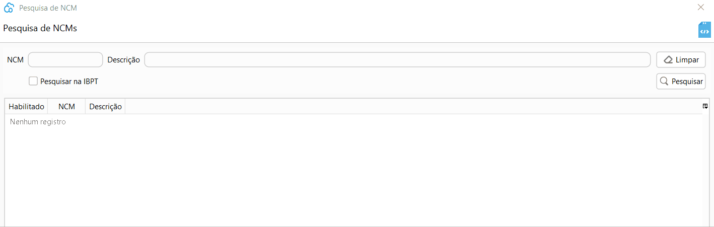

[Início](index.md) / [Gestão Fiscal](gestao_fiscal.md) /NCM

{: #ncm}

### NCM

NCM é a sigla para Nomenclatura Comum do Mercosul. Toda e qualquer mercadoria que circula no Brasil deve ter o código NCM informado no documento fiscal. 

Antes de informar no produto você deve habilitar o código de NCM. 

Acesse Menu: Gestão Fiscal>>NCM.

Marque o campo `Pesquisar na IBPT` e busque a NCM, clique com o botão inverso do mouse e depois clique em `Habilitar para uso`.

Depois disso o NCM está pronto habilitado para ser informado no produto.aaa

[Voltar](gestao_fiscal.md)                                                                                                                                      

