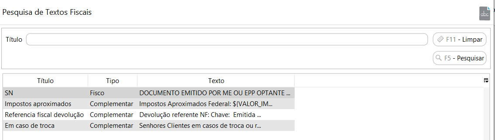
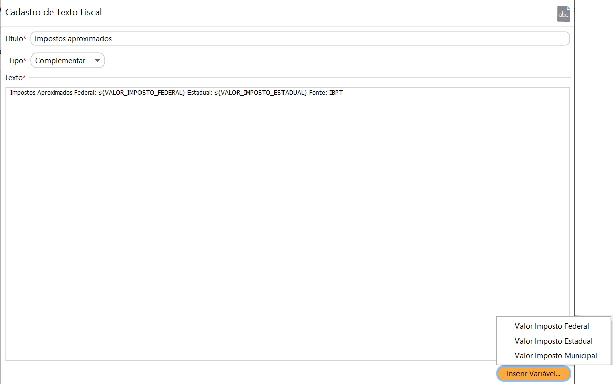

[Início](index.md) / [Gestão Fiscal](gestao_fiscal.md) /Texto Fiscal

{: #textofiscal}

### Texto Fiscal

Os textos fiscais são as informações que são impressas no rodapé do DANFE. As informações podem ser de dois tipos:

**Fisco**: Este registro é utilizado para informar anotações de escrituração determinadas pela legislação pertinente aos lançamentos fiscais, tais como: ajustes efetuados por diferimento parcial de imposto, antecipações, diferencial de alíquota e outros.  Essa informação é levada para a tag <infAdFisco> no XML

**Complementar**: são as informações complementares de interesse do fisco existentes nos documentos fiscais. Exemplo: nos casos de documentos fiscais de entradas de devolução, informar o documento fiscal referenciado, ou nos impostos aproximados quando na venda para consumidor final. Essa informação é levada para a tag <infCpl> no XML

{: #variaveis}

#### Campos variáveis

Essas variáveis são campos que serão substituídos pelo valor real em cada NF-e. Pode-se observar um exemplo de utilização no texto de Impostos aproximados:

[Voltar](gestao_fiscal.md)                                                                                                                                      

