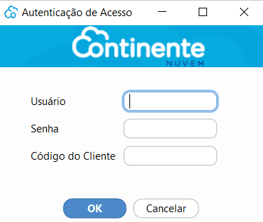
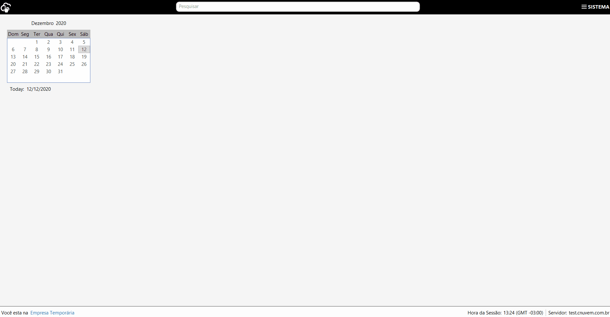

[Início](index.md) / Primeiro Acesso

{: #primeiro_acesso}

## Primeiro Acesso

Este é o Guia de instruções para o seu primeiro acesso no Continente Nuvem.

Siga o passo a passo a seguir para ter sua empresa no CN, fique tranquilo que são poucas etapas.

Ao realizar a instalação do Continente Nuvem, um ícone de acesso será instalado em sua área de trabalho.

 Acesse o sistema com as seguintes informações:

Usuário: admin@admin

Senha: admin

Código do Cliente:  *será repassado por e-mail*

1º   Acesse o Menu Administração>>Empresa: Edite os dados da empresa temporária para os dados da sua empresa. No campo domínio você deve alterar o  “admin” e informar o domínio que você irá acessar o sistema. O domínio pode ser um dos nomes de sua empresa, ou algo que identifique a empresa que você está acessando.

2º  Acesse o Menu Administração>>Usuário: Crie o(s) usuário(s) e defina a(s) senha(s). Esses serão os usuários de acesso ao sistema.. Ex.: Se você criou o usuário “asilva” e informou o domínio “continente”: seu acesso ao sistema será asilva@continente. 

3º Acesse o Menu Sistema e clique em **Trocar usuário** e pronto! Agora sua empresa está no Continente Nuvem e você já pode acessar através do usuário e senha que você criou. Obs. *Não esqueça de informar o @domínio junto ao seu usuário.*

Agora que você já está acessando o sistema, veja também nossa orientações  de [Configurações para Emissão de NF-e]() e [Configurações para emissão de NFC-e]()

[Voltar](index.md)

