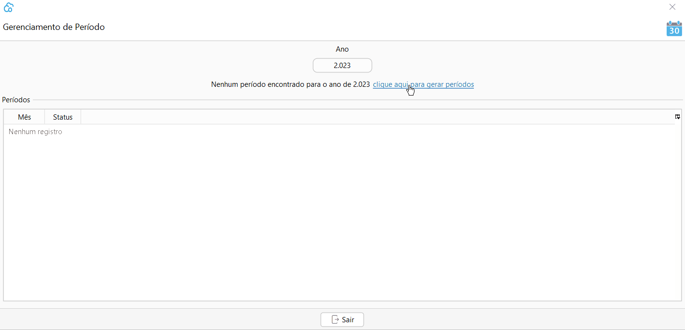

[Início](index.md) / Primeiro Acesso

{: #primeiro_acesso}

## Primeiro Acesso

Siga o passo a passo a seguir para o seu primeiro acesso no Continente Nuvem. Fique tranquilo que são poucas etapas.

#### 1º Acessar

 Ao realizar a instalação do Continente Nuvem, um ícone de acesso será instalado em sua área de trabalho. 

Acesse o sistema com o usuário e senha que você cadastrou e informe o código do cliente você recebeu no e-mail de liberação de acesso.

#### 2º Completar os dados da empresa

Acesse o Menu Administração>>Empresa:

Complete os dados da sua empresa, lembre-se que estes dados serão impressos nos documentos fiscais emitidos.

No menu `Mais` no cadastro da empresa é possível adicionar a imagem de identificação (logo) da empresa que será impressa nos documentos fiscais e relatórios.

#### 3º Abrir período

Acesse o Menu Administração>>Período:

Informe o ano e clique em gerar períodos, selecione o mês e clique em abrir período.

**Orientamos sempre manter somente o período atual com status Aberto.**

Saiba mais sobre o período [clicando aqui](administracao_periodo.md).

### Tudo pronto! 

Agora você pode utilizar o seu Continente Nuvem normalmente, se você for emissor de NF-e ou NFC-e sugerimos que leia as seguintes orientações:

 [Configurações para Emissão de NF-e](configuracoes_emissao_nfe) 

 [Configurações para emissão de NFC-e](configuracoes_emissao_nfce)

[Voltar](index.md)

