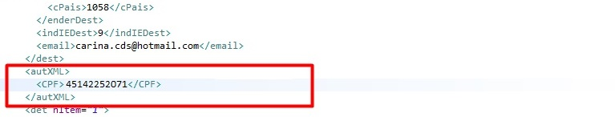

[Início](index.md) / Primeiro Acesso

{: #primeiro_acesso}

## Primeiro Acesso

Siga o passo a passo a seguir para o seu primeiro acesso no Continente Nuvem. Fique tranquilo que são poucas etapas.

#### 1º Acessar

 Ao realizar a instalação do Continente Nuvem, um ícone de acesso será instalado em sua área de trabalho. 

Acesse o sistema com o usuário e senha que você cadastrou e informe o código do cliente você recebeu no e-mail de liberação de acesso.

#### 2º Completar os dados da empresa

Acesse o Menu Administração>>Empresa:

Complete os dados da sua empresa, lembre-se que estes dados sairão nos documentos fiscais emitidos.

Na aba Contador informe os dados do seu Contador

#### Dados do Contador

{: #autxml}

##### Autorizado no XML emitido - autXML

 Ao marcar este campo o CPF ou CNPJ informado será levado para o XML na tag <autXML>, autorizando assim a consulta do XML da NF-e no Portal Nacional.

{: #emailcontador}

##### Receber por e-mail DF-e emitidos 

Ao marcar este campo o sistema fará o envio automático de um e-mail com o XML de todos os Documentos fiscais emitidos no último mês completo juntamente com um relatório de documentos emitidos no mesmo período. O e-mail será enviado para o endereço informado no campo e-mail as 00:00h do dia parametrizado no campo `Todo dia` .

 Agora que sua empresa está no Continente Nuvem, veja também nossas orientações  de [Configurações para Emissão de NF-e](configuracoes_emissao_nfe) e [Configurações para emissão de NFC-e](configuracoes_emissao_nfce)

[Voltar](index.md)

