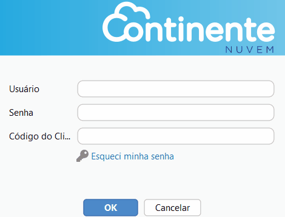

[Início](index.md) / Primeiro Acesso

{: #primeiro_acesso}

## Primeiro Acesso

Siga o passo a passo a seguir para o seu primeiro acesso no Continente Nuvem. Fique tranquilo que são poucas etapas.

Ao realizar a instalação do Continente Nuvem, um ícone de acesso será instalado em sua área de trabalho.

 Acesse o sistema com as seguintes informações:

Usuário: admin@admin

Senha: admin

Código do Cliente:  *nós lhe informaremos o seu código do cliente*

#### 1º Alterar os dados da Empresa temporária

Acesse o Menu Administração>>Empresa: Edite os dados da empresa temporária para os dados da sua empresa. No campo domínio você deve alterar o  “admin” e informar o domínio que você irá acessar o sistema. O domínio pode ser um dos nomes de sua empresa, ou algo que identifique a empresa que você está acessando.

#### 2º Crie os usuários

Acesse o Menu Administração>>Usuário: Crie o(s) usuário(s) e senha(s). Esses serão os usuários de acesso ao sistema.. Ex.: Se você criou o usuário “asilva” e informou o domínio “continente”: seu acesso ao sistema será asilva@continente. 

#### 3º Acesse o sistema com o novo usuário

Acesse o Menu Sistema e clique em **Trocar usuário** e pronto! Agora é só acessar com o novo usuário que você criou. Obs. *Não esqueça de informar o @domínio junto ao seu usuário.*

 Agora que sua empresa está no Continente Nuvem, veja também nossas orientações  de [Configurações para Emissão de NF-e]() e [Configurações para emissão de NFC-e]()

[Voltar](index.md)

