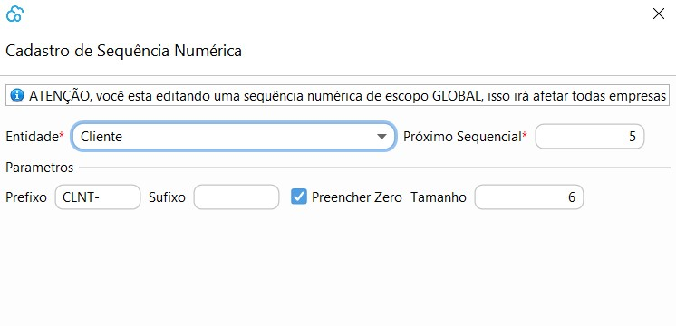

## Sequência Númerica

Nesta tela serão parametrizados as sequências numéricas utilizadas em todos os processos do sistema Todas as sequencias virão pré-cadastradas 

As sequências `NFE` `NFCe` `Lote NFe` `Lote NFCe`são obrigatórias para os emissores de NFE e NFCe e devem ser parametrizadas somente com o `Próximo Sequencial`

A sequências que representam processos, como por exemplo `Venda` ou `Compra` também são obrigatórias, e todos os parametros podem ser editados. O exemplo na tela será como será exibido o código no processo.

As sêquencias que representam  cadastros, exemplo `Cliente` e `Fornecedor` não são obrigatórios e todos os parametros podem ser editados.

Caso a sequência desse cadastro seja excluída, o código será incluso manualmente no momento do cadastro.

 

[Voltar](sistema.md)

