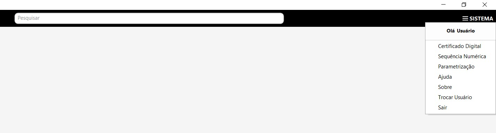

# Sistema

​	No menu Sistema estão algumas parametrizações que devem ser executadas uma única vez no início da utilização do sistema, ou quando houver alguma alteração.

​	Estão também localizadas nesse menu as opções de Trocar Usuário e Sair do sistema.

- [Sequência Numérica](sequencia_numerica)

  

- Ajustes
  
  - [Fiscal](ajustes_fiscal)
  - [Contas a Receber](ajustes_receber)
  - [Contabilidade](ajustes_contabilidade.md)
  - [Dimensão de Estoque](ajustes_dimensao_estoque)
  - [Venda](ajustes_venda)

[Voltar](index.md)

