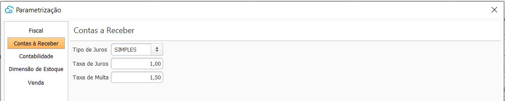

{: #contasreceber}

### Ajustes Contas à Receber

As parametrizações do Contas à receber devem ser feitas para cada empresa cadastrada. 

Parametrizações não obrigatórias. As alíquotas serão utilizadas como base para cálculo do juros e multa no Contas à Receber.

[Voltar](sistema.md#ajustes)

