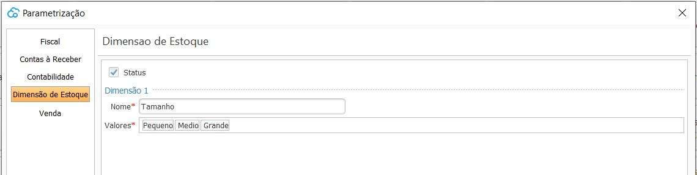
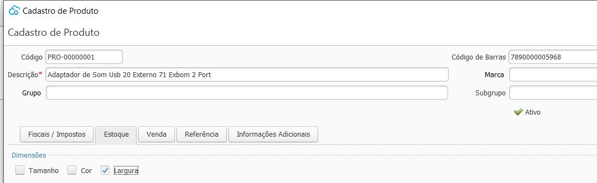
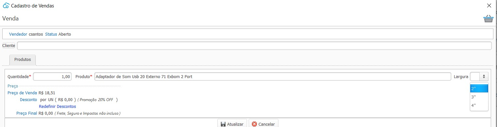
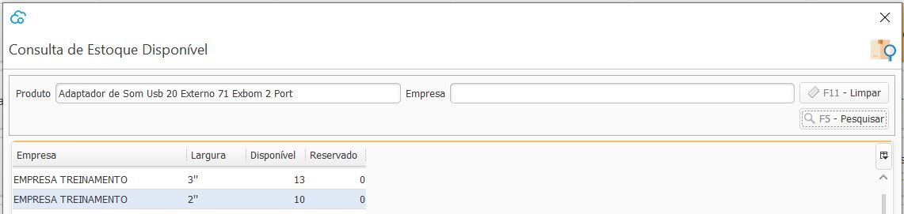

{: #dimensaoestoque}

### Ajustes Dimensão de Estoque

As parametrizações de Dimensão de Estoque são feitas uma única vez para todas as empresas.

As dimensões de estoque não são obrigatórias, elas são um facilitador para controle e gerenciamento do estoque.

Onde o Nome é a Dimensão utilizada e os Valores são as opções disponíveis.

Podem ser cadastradas até 3 dimensões de estoque, que após criadas devem ser habilitadas nos produtos que as utilizarão:

Uma vez parametrizada a dimensão, essa informação é exigida em todos os processos do sistema:

O gerenciamento de estoque é feito de acordo com as dimensões parametrizadas por item:

[Voltar](sistema.md#ajustes)

