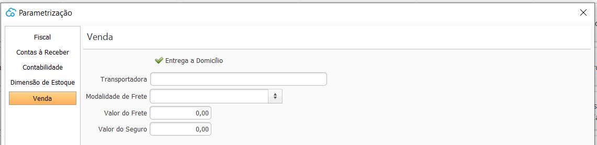

## Ajustes Venda

{: #venda}

As parametrizações fiscais devem ser feitas para cada empresa cadastrada. 

Quando a opção Entrega a Domicílio está habilitada nos parâmetros

No processo de Venda a opção Entrega à Domicílio fica disponível, podendo ser marcado, caso a mercadoria seja entregue pelo próprio estabelecimento até o domicilio do cliente.

[Voltar](sistema.md#ajustes)

