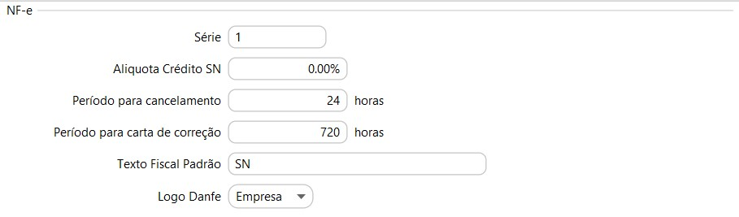
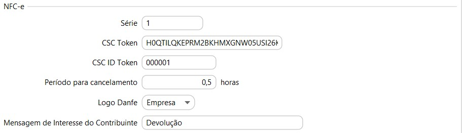
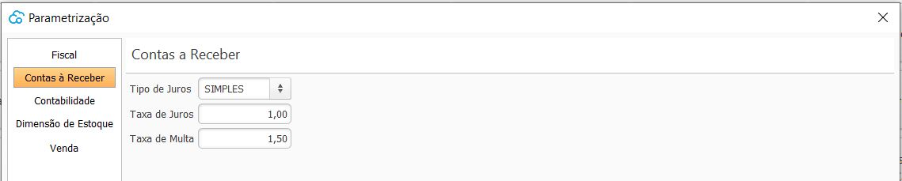
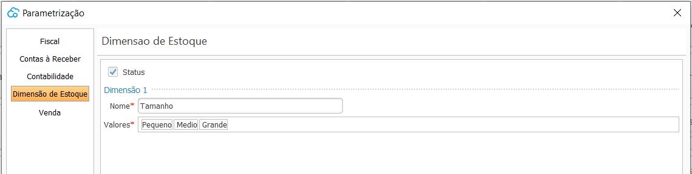
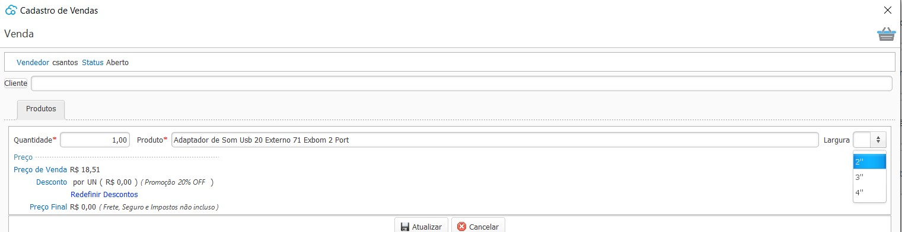
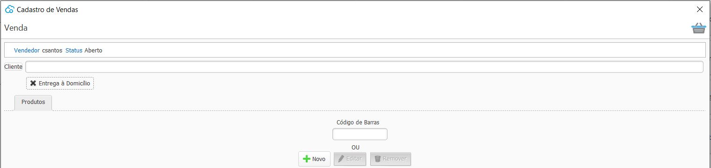
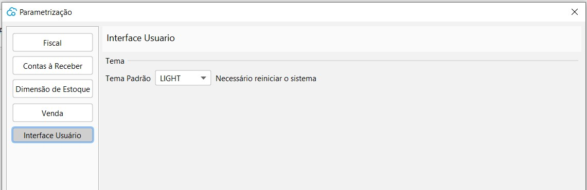
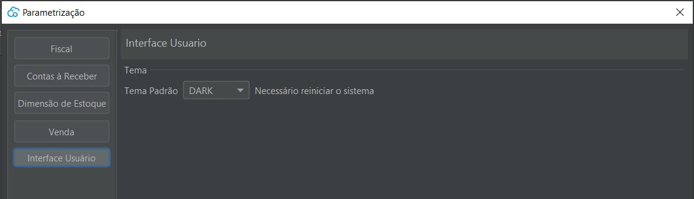

[Início](index.md) / [Sistema](sistema.md) / Parametrização

{: #fiscal}

### Parametrização Fiscal

As parametrizações fiscais devem ser feitas para cada empresa cadastrada e estão divididas em:

{: #nfe}

#### Fiscal - NFe

`Série` deve ser preenchido para as empresa emitentes de [NF-e](nfe.md).

`Alíquota Crédito SN` deve ser preenchido com a alíquota para as empresas do [SImples Nacional](simples_nacional.md) que permitem crédito de ICMS.

`Período para cancelamento` deve ser preenchido com o período que a empresa deseja permitir fazer o cancelamento de NF-e, deve ser igual ou menor ao período permitido pelo [SEFAZ](sefaz.md).

`Texto Fiscal Padrão` Esse texto é opcional. Deve ser preenchido com algum [Texto fiscal](texto_fiscal.md), tipo [Fisco](texto_fiscal_fisco.md) que será impresso em todas as NF-e emitidas. Essa mensagem será levada para a tag <infAdFisco> do XML. da NF-E.

`Logo Danfe` pode ser definido se haverá ou não impressão de Logo no DANFE do NF-E e se será a logo da empresa ou logo da NF-e

{: #nfce}

#### Fiscal - NFCe

`Série` deve ser preenchido para as empresa emitentes de [NFC-e](nfce.md)

`CSC Token`  O Código de Segurança do Contribuinte (CSC) token é um código de segurança alfanumérico (uma senha), de conhecimento exclusivo do contribuinte e da [SEFAZ](sefaz.md)  usado para garantir a autoria e a autenticidade do DANFE NFC-e. 

Na maioria dos casos, é obtido pelo site da Sefaz do estado, separando entre ambiente de homologação e de produção. 

- **Paraná (PR):** 

Para o estado no PR está disponível no [Portal RECEITA/PR](https://receita.pr.gov.br/login), em Serviço: Menu DF-e /NFC-e / CSC / Controle.

`CSC ID Token` O Código de Segurança do Contribuinte (CSC) ID é um código complementar ao Token e deve ser obtido juntamente com o Token.

`Período para cancelamento` deve ser preenchido com o período que a empresa deseja permitir fazer o cancelamento de NFC-e, deve ser igual ou menor ao período permitido pela SEFAZ.

`Logo Danfe` pode ser definido se haverá ou não impressão de Logo no DANFE do NFC-E e se será a logo da empresa ou logo da NFC-E

`Mensagem de Interesse do Contribuinte` Essa mensagem é opcional e será impresso no rodapé do DANFE logo após a informação dos impostos aproximados. Deve ser preenchido com algum [Texto fiscal](texto_fiscal.md), tipo [Complementar](texto_fiscal_complementar.md). Essa mensagem será levada para a tag <infCpl> do XML da NFC-e.

{: #geral}

#### Fiscal - Geral

`Certificado Digital` deve ser parametrizado o certificado digital que foi importado no meu [certificado digital](sistema_certificado_digital.md#certificadodigital).

`Documento Fiscal Padrão` o tipo parametrizado será utilizado como padrão no cadastro dos Clientes, podendo, se necessário, fazer a alteração em cada cliente.

`Texto Fiscal Impostos Aproximados` deve ser preenchido com algum [Texto fiscal](texto_fiscal.md), tipo [Complementar](texto_fiscal_complementar.md) e será impresso em todas as NF-e em operações com consumidor final e em todas as NFC-e. Essa mensagem será levada para a tag <infCpl> do XML.

Esse texto fiscal deverá ser parametrizado com as [variáveis](texto_fiscal_variavel.md) que farão o cálculo dos impostos aproximados de acordo com as alíquotas da [Tabela IBPT](ajustes_fiscal_tabela_ibpt.md).

{: #contasreceber}

### Parametrização Contas à Receber

As parametrizações do Contas à receber devem ser feitas para cada empresa cadastrada. 

Parametrizações não obrigatórias. As alíquotas serão utilizadas como base para cálculo do juros e multa no Contas à Receber.

{: #dimensaoestoque}

### Parametrização Dimensão de Estoque

As parametrizações de Dimensão de Estoque são feitas uma única vez para todas as empresas.

As dimensões de estoque não são obrigatórias, elas são um facilitador para controle e gerenciamento do estoque.

Onde o Nome é a Dimensão utilizada e os Valores são as opções disponíveis.

Podem ser cadastradas até 3 dimensões de estoque, que após criadas devem ser habilitadas nos produtos que as utilizarão:

Uma vez parametrizada a dimensão, essa informação é exigida em todos os processos do sistema:

O gerenciamento de estoque é feito de acordo com as dimensões parametrizadas por item:

{: #venda}

### Parametrização Venda

As parametrizações fiscais devem ser feitas para cada empresa cadastrada. 

Quando a opção Entrega a Domicílio está habilitada nos parâmetros

No processo de Venda a opção Entrega à Domicílio fica disponível, podendo ser marcado, caso a mercadoria seja entregue pelo próprio estabelecimento até o domicilio do cliente.

{: #interfaceusuario}

### Parametrização Interface Usuário

A Interface do usuário vem por padrão o tema Default. Além desta existe o tema Light e Dark que podem ser parametrizados por usuário.

[Voltar](sistema.md#ajustes)

