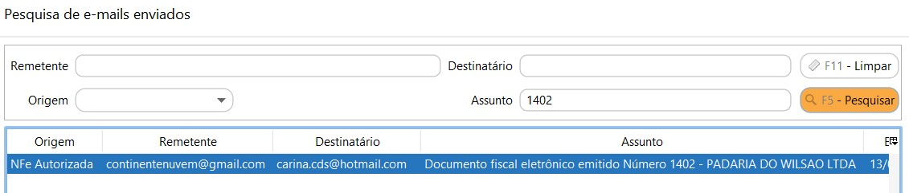
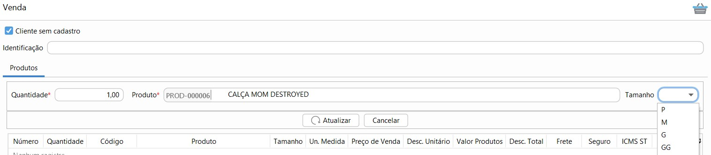
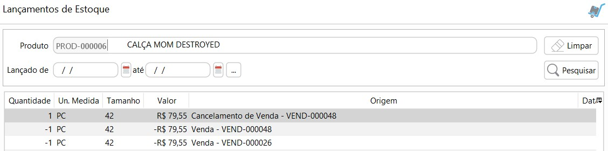
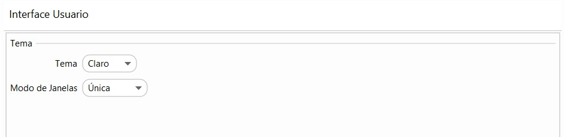
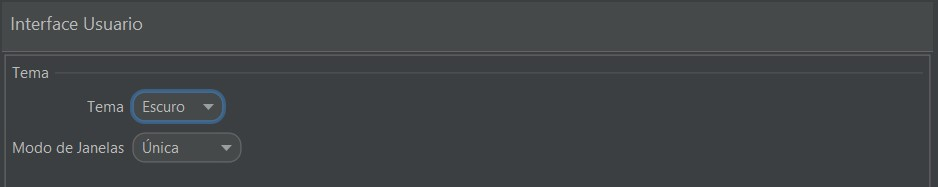

[Início](index.md) / [Sistema](sistema.md) / Parametrização

{: #fiscal}

### Parametrização Fiscal

As parametrizações fiscais devem ser feitas para cada empresa cadastrada e estão divididas em:

{: #nfe}

#### Fiscal - NFe

`Série` deve ser preenchido para as empresa emitentes de [NF-e](http://sped.rfb.gov.br/pagina/show/1328).

`Alíquota Crédito SN` deve ser preenchido com a alíquota para as empresas do [SImples Nacional](http://www8.receita.fazenda.gov.br/SimplesNacional/Documentos/Pagina.aspx?id=3) que permitem crédito de ICMS.

`Período para cancelamento` deve ser preenchido com o período que a empresa deseja permitir fazer o cancelamento de NF-e, deve ser igual ou menor ao período permitido pela Sefaz. O período aceito pela Sefaz da maioria das UFs é até 24 horas após a emissão da NF-e. A parametrização default é de 24 horas.

`Período para carta de correção` deve ser preenchido com o período que a empresa deseja permitir fazer enviar uma carta de correção para uma NF-e anteriormente aprovada, deve ser igual ou menor ao período permitido pela Sefaz. O período aceito pela Sefaz é até 720 horas após a emissão da NF-e. A parametrização default é de 720 horas.

`Texto Fiscal Padrão` Esse texto é opcional. Deve ser preenchido com algum [texto fiscal](gestao_fiscal_texto_fiscal.md), tipo Fisco que será impresso em todas as NF-e emitidas. Essa mensagem será levada para a tag <infAdFisco> do XML. da NF-E.

`Logo Danfe` pode ser definido se haverá ou não impressão de Logo no DANFE do NF-E e se será a logo da empresa ou logo da NF-e

{: #emaildestinatario}

`Enviar e-mail para o destinatário` deve ser marcado se a empresa deseja ou não enviar automaticamente o DANFE e XML para os participantes da NF-e, que pode ser um cliente ou fornecedor. Ao marcar XML, Danfe ou Ambos,  no momento da autorização da NF-e o sistema irá enviar automaticamente os documentos para o(s) endereços de e-mail tipo NF-e informados no cadastro do cliente ou fornecedor.

Deve-se atentar para que se não houver e-mail parametrizado como NFE no cadastro do participante o e-mail não será enviado. Pode ser parametrizado mais de um endereço de e-mail como NF-e, assim o sistema fará um envio para cada endereço de e-mail cadastrado.

Os e-mails enviados podem ser consultados através da tela de pesquisa de e-mails enviados, no menu administração.

Para este caso, pode-se filtrar pela origem "NF-e Autorizada" pelo endereço de e-mail do destinatário ou até mesmo pelo número da NF-e no campo assunto:

{: #nfce}

#### Fiscal - NFCe

`Série` deve ser preenchido para as empresa emitentes de [NFC-e](http://sped.rfb.gov.br/pagina/show/1519)

`CSC Token`  O Código de Segurança do Contribuinte (CSC) token é um código de segurança alfanumérico (uma senha), de conhecimento exclusivo do contribuinte e da Sefaz e é usado para garantir a autoria e a autenticidade do DANFE NFC-e. 

Na maioria dos casos, é obtido pelo site da Sefaz do estado, separando entre ambiente de homologação e de produção. 

- **Paraná (PR):** 

Para o estado no PR está disponível no [Portal RECEITA/PR](https://receita.pr.gov.br/login), em Serviço: Menu DF-e /NFC-e / CSC / Controle.

`CSC ID Token` O Código de Segurança do Contribuinte (CSC) ID é um código complementar ao Token e deve ser obtido juntamente com o Token.

`Período para cancelamento` deve ser preenchido com o período que a empresa deseja permitir fazer o cancelamento de NFC-e, deve ser igual ou menor ao período permitido pela SEFAZ. O período aceito pela Sefaz da maioria das UFs é até 30 minutos após a emissão da NFC-e. A parametrização default é de 0,5 horas.

`Logo Danfe` pode ser definido se haverá ou não impressão de Logo no DANFE do NFC-E e se será a logo da empresa ou logo da NFC-E

`Mensagem de Interesse do Contribuinte` Essa mensagem é opcional e será impresso no rodapé do DANFE logo após a informação dos impostos aproximados. Deve ser preenchido com algum [texto fiscal](gestao_fiscal_texto_fiscal.md), tipo Complementar. Essa mensagem será levada para a tag <infCpl> do XML da NFC-e.

{: #geral}

#### Fiscal - Geral

`Ambiente`deve ser parametrizado com o ambiente de emissão dos documentos Fiscais eletrônicos. O ambiente de Homologação não tem validade fiscal.

`Certificado Digital` deve ser parametrizado o certificado digital que foi importado no meu [certificado digital](sistema_certificado_digital.md#certificadodigital).

`Documento Fiscal Padrão` o tipo parametrizado será utilizado como padrão no cadastro dos Clientes, podendo, se necessário, fazer a alteração em cada cliente.

`Texto Fiscal Impostos Aproximados` deve ser preenchido com algum [Texto fiscal](gestao_fiscal_texto_fiscal.md), tipo Complementar e será impresso em todas as NF-e em operações com consumidor final e em todas as NFC-e. Essa mensagem será levada para a tag <infCpl> do XML.

Esse texto fiscal deverá ser parametrizado com as [variáveis](gestao_fiscal_texto_fiscal.md#variaveis) que farão o cálculo dos impostos aproximados de acordo com as alíquotas da [Tabela IBPT](ajustes_fiscal_tabela_ibpt.md).

`Período para inutilização` deve ser preenchido com o período que a empresa deseja permitir fazer a inutilização da numeração dos documentos fiscais quando realizado um cancelamento de venda. O período aceito pela Sefaz é até o 10º dia do mês subsequente a emissão. A parametrização default é de 240 horas.

{: #contasreceber}

### Parametrização Contas à Receber

As parametrizações do Contas à receber devem ser feitas para cada empresa cadastrada. 

Parametrizações não obrigatórias. As alíquotas serão utilizadas como base para cálculo do juros e multa no Contas à Receber.

{: #dimensaoestoque}

### Parametrização Dimensão de Estoque

As parametrizações de Dimensão de Estoque são feitas uma única vez para todas as empresas.

As dimensões de estoque não são obrigatórias, elas são um facilitador para controle e gerenciamento do estoque.

Onde o Nome é a Dimensão utilizada e os Valores são as opções disponíveis.

Podem ser cadastradas até 3 dimensões de estoque, que após criadas devem ser habilitadas nos produtos que as utilizarão:

Uma vez parametrizada a dimensão, essa informação é exigida em todos os processos do sistema:

O gerenciamento de estoque é feito de acordo com as dimensões parametrizadas por item:

{: #venda}

### Parametrização Venda

As parametrizações de venda devem ser feitas para cada empresa cadastrada. 

Quando a opção Entrega a Domicílio estiver habilitada nos parâmetros de venda, esta opção ficará também habilitada na tela de venda, onde se marcada levará a informação de entrega a domicílio para o XML do NFC-e campo <indPres>4. 

Os campos de transportadora, modalidade e valores de frete também poderão ser preenchidos para que sejam levados de maneira default para a venda que tiver entrega a domicílio.

O campo vendedor pode ser marcado como obrigatório nos processos de venda.

{: #interfaceusuario}

### Parametrização Interface Usuário

A Interface do usuário vem por padrão o Light. Além desta existe o tema Dark que é indicada para aqueles que já trabalham com o sistema operacional com essa interface.

Ao alterar o tema é necessário sair do sistema e entrar novamente. 

[Voltar](sistema.md#ajustes)

