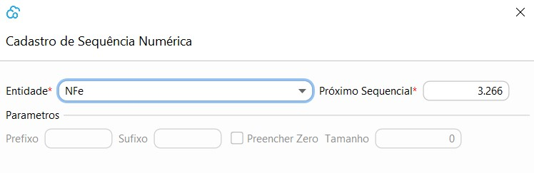
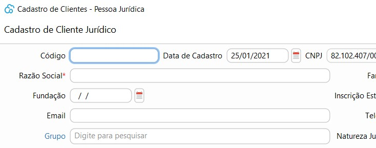

[Início](index.md) / [Sistema](sistema.md) / Sequência Numérica

{: #sequencianumerica}

### Sequência Numérica

Nesta tela estão parametrizados as sequências numéricas utilizadas em todos os processos do sistema Todas as sequencias vem pré-cadastradas 

As sequências `NFE` `NFCe` são obrigatórias para os emissores de NFE e NFCe e devem ser parametrizadas somente com o `Próximo Sequencial` a ser emitido.

A sequências que representam processos, exemplo `Venda` ou `Compra` também são obrigatórias e todos os parâmetros podem ser editados. O exemplo na tela será como será exibido o código no processo.

As sequências que representam  cadastros, exemplo `Cliente` ou `Fornecedor` não são obrigatórios e todos os parâmetros podem ser editados.

Caso a sequência desse cadastro seja excluída, o código será incluso manualmente no momento do cadastro.

 

[Voltar](sistema.md)

