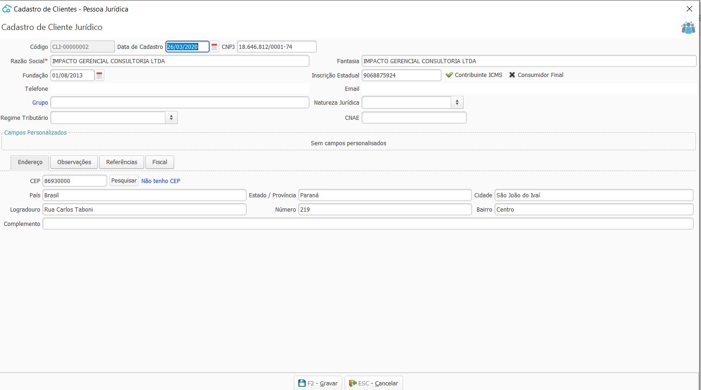

{: #cadastro}

### Cliente

Nesta tela devem ser cadastrados todos os Clientes que a  empresa tem e movimenta.

Deve-se atentar aos campos de endereço e Inscrição estadual pois eles sairão na NF-e e NFC-e, caso preenchimento incorreto os documentos fiscais podem ser Rejeitados pelo SEFAZ.

Quando o contribuinte for ISENTO de inscrição estadual, deve-se escrever ISENTO no campo específico. Quando o contribuinte não tiver inscrição estadual deixar o campo em branco, não marcar o campo Contribuinte ICMS e marcar o campo Consumidor Final.

Um cliente Pessoa Física é automaticamente um consumidor final.

Outro ponto importante no cadastro do cliente é a aba Fiscal, nesta aba pode ser parametrizado o modelo de documento padrão para faturamento. 

Caso nos [ajustes fiscais](sistema_ajuste_fiscal.md#geral) esteja parametrizado que o modelo de documento padrão para faturamento da empresa é NFC-e, pode ser parametrizado em clientes específicos o modelo NF-e e vise-versa.

[Voltar](vendas.md#vendas)