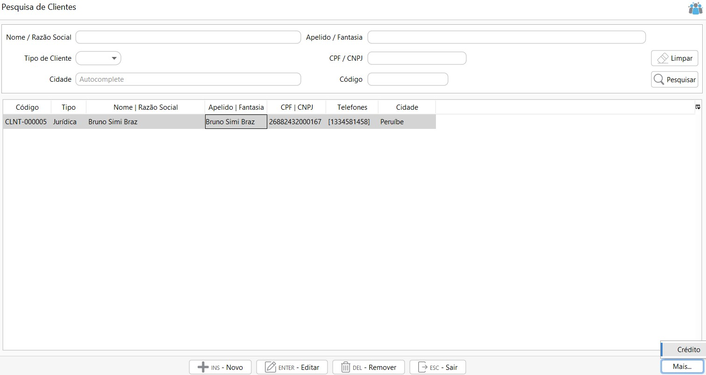
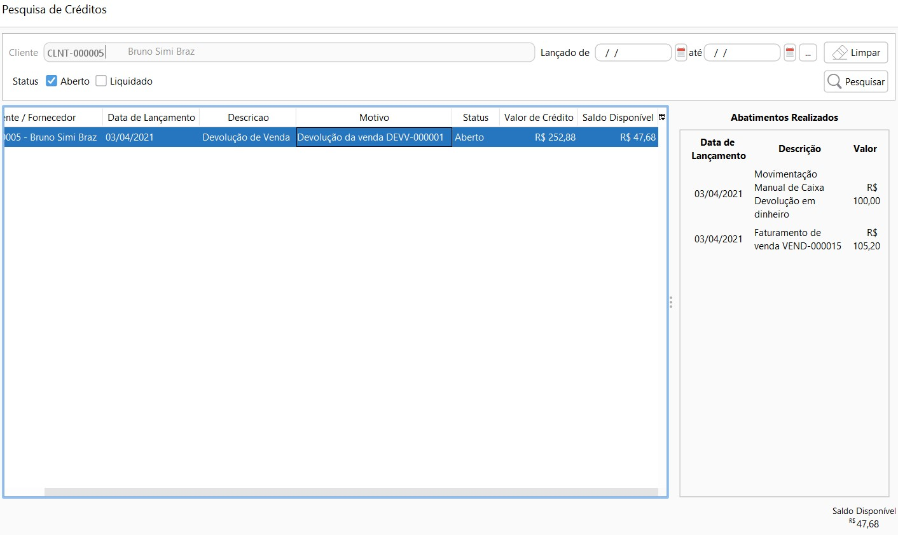

[Início](index.md) / [Vendas](vendas.md) / Cliente

{: #cadastro}

###  Cliente

Nesta tela devem ser cadastrados todos os Clientes que a  empresa tem e movimenta.

O sistema identifica através do CPF\CNPJ se cliente é Pessoa Física ou Jurídica e habilita campos específicos para cada Tipo de Cliente, por exemplo o campo Inscrição Estadual não aparece quando o cliente é pessoa física, ou o campo RG não aparece quando cliente é pessoa jurídica.

Para ambos os tipos de cliente, no cadastramento deve-se atentar aos campos de endereço e Inscrição estadual pois eles sairão na NF-e e NFC-e, caso preenchimento incorreto os documentos fiscais podem ser Rejeitados pelo SEFAZ.

Para clientes pessoa jurídica, quando o contribuinte for ISENTO de inscrição estadual, deve-se escrever ISENTO no campo específico. Quando o contribuinte não tiver inscrição estadual deixar o campo em branco, não marcar o campo Contribuinte ICMS e marcar o campo Consumidor Final.

Um cliente Pessoa Física é automaticamente um consumidor final.

{: #fiscal}

Outro ponto importante no cadastro do cliente é a aba Fiscal, nesta aba pode ser parametrizado o modelo de documento padrão para faturamento. 

Caso nos [ajustes fiscais](sistema_ajustes.md#geral) esteja parametrizado que o modelo de documento padrão para faturamento da empresa é NFC-e, pode ser parametrizado em clientes específicos o modelo NF-e e vise-versa.

{: #credito}

#### Crédito de Cliente

Através do botão `Mais` no canto direito inferior da tela é possível acessar o menu Crédito.

Neste menu ficam disponíveis as transações que geraram crédito para o cliente. Essas transações podem ser originadas de uma movimentação manual de Caixa ou Banco, onde neste caso o cliente paga um valor adiantado para empresa, ou pode ser decorrente de uma devolução de vendas.

O abatimento do crédito pode ser feito através do lançamento da Venda, do Contas a Receber ou até mesmo pela movimentação manual de banco ou caixa, quando a opção "Liquidar crédito cliente\fornecedor" estiver marcada no motivo.

Quando o crédito for totalmente liquidado ele ficará com status liquidado.

[Voltar](vendas.md#vendas)