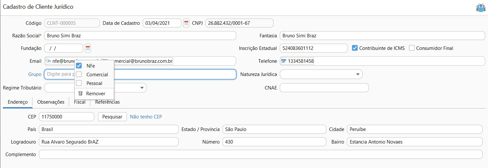

[Início](index.md) / [Vendas](vendas.md) / Cliente

{: #cadastro}

###  Cliente

Nesta tela devem ser cadastrados todos os Clientes que a  empresa tem e movimenta.

O sistema identifica através do CPF\CNPJ se cliente é pessoa física ou Jurídica e habilita campos específicos para cada tipo de cliente, por exemplo o campo Inscrição Estadual não aparece quando o cliente é pessoa física, ou o campo RG não aparece quando cliente é pessoa jurídica.

No cadastramento deve-se atentar aos campos de endereço e Inscrição estadual pois eles sairão na NF-e e NFC-e, caso preenchimento incorreto os documentos fiscais podem ser Rejeitados pelo SEFAZ.

Para clientes pessoa jurídica, quando o contribuinte for ISENTO de inscrição estadual, deve-se escrever ISENTO no campo específico. Quando o contribuinte não tiver inscrição estadual deixar o campo em branco, não marcar o campo Contribuinte ICMS e marcar o campo Consumidor Final.

Um cliente Pessoa Física é automaticamente um consumidor final.

Outro campo que deve-se atentar é o e-mail, para os clientes jurídicos que terão faturamento via NF-e deve ser informar o e-mail para onde será enviada automaticamente a  NF-e quando faturado. O e-mail deve ser parametrizado como tipo "NF-e" para isto basta clicar o o botão inverso do mouse em cima.

{: #fiscal}

#### Fiscal

Na aba fiscal do cadastro do cliente deve ser parametrizado quando um cliente exigir um documento fiscal diferente do padrão da empresa. 

Por exemplo se você emite mais NFC-e, você pode parametrizar este como documento padrão, em [Parametrização Fiscal](sistema_parametrizacao.md#geral) e então em cada cliente que for diferente a essa regra parametrizar como NF-e.

{: #credito}

#### Crédito de Cliente

Através do botão `Mais` no canto direito inferior da tela de pesquisa de  clientes é possível acessar o menu Crédito.

Neste menu ficam disponíveis as transações que geraram crédito para o cliente. Essas transações podem ser originadas de uma movimentação manual de Caixa ou Banco, onde neste caso o cliente paga um valor adiantado para empresa, ou pode ser decorrente de uma devolução de vendas.

O crédito para um cliente é gerado através do faturamento de uma devolução de venda, ou através de um adiantamento que pode ser feito pela movimentação de Caixa ou Banco quando a opção " Gerar crédito cliente\fornecedor" estiver marcada no motivo.

O abatimento do crédito pode ser feito através de um faturamento de venda ou recebimento de um contas a Receber ou até mesmo pela movimentação manual de banco ou caixa, quando a opção "Liquidar crédito cliente\fornecedor" estiver marcada no motivo.

Quando o crédito for totalmente liquidado ele ficará com status liquidado.

Na tela de consulta de crédito o sistema informa do valor do crédito gerado e o saldo em aberto e no painel a direta os abatimentos que já foram feitos.

No final da tela o Saldo total disponível em crédito para este cliente.

[Voltar](vendas.md#vendas)