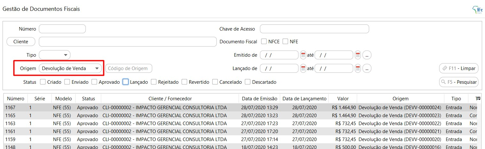

[Início](index.md) / [Vendas](vendas.md) / Devolução de Venda

{: #devolucaovenda}

### Devolução de Venda

E possível fazer uma devolução de venda de duas maneiras:

1ª através do menu próprio de Devolução de Venda, onde neste caso a devolução é criada integralmente, informando o cliente e produtos manualmente. Este menu é indicado quando a Venda que está sendo devolvida não está lançada no sistema. 

2º A segunda maneira é através do atalho que fica no botão mais na pesquisa de vendas, neste caso ao abrir a devolução de venda a partir de uma venda o sistema já traz automaticamente preenchido o Cliente e os produtos da venda, sendo necessário apenas indicar a quantidade que será devolvida nos itens que serão devolvidos. Caso a venda tenha sido para um cliente não cadastrado, o cliente também poderá ser informado manualmente.

{: #redefinirimpostos}

#### Redefinir Impostos

Os impostos na Devolução de Venda são os mesmos impostos calculados na venda, são os impostos que estão parametrizados no Grupo de Imposto de Venda amarrado ao produto.  O CST e CFOP são próprios para a devolução.

Caso necessário os impostos podem ser revisados, clicando com o botão inverso do mouse em cima da linha, em Redefinir Impostos.

Ao abrir a tela de redefinir impostos, ficam disponíveis o detalhamento dos impostos que foram calculados.

É possível alterar o grupo de impostos, e assim o sistema faz todo o recálculo dos impostos de acordo com o impostos do novo grupo selecionado:

Ou pode-se alterar diretamente o valor do Imposto, Base, CST calculados, para isso o campo "Informar Manualmente" deve ser marcado, assim todos os campos permitem edição.

Ao alterar os impostos manualmente o sistema não faz nenhum novo cálculo, por exemplo se for alterado a base de cálculo o sistema não recalcula o valor do imposto. 

{: #frete}

#### Frete

Na aba Frete devem ser inseridos os valores de Frete e Seguro que compõe o valor total da Nota Fiscal. 

Ao clicar no botão Gravar a Devolução de Venda poderá ser faturada no mesmo momento ou então será salva com status aberto na pesquisas da Devolução de Venda.

{: #faturamento}

#### Faturamento

Nesta tela é feito o faturamento da Devolução de Vendas, as informações estão dispostas em 6 abas:

{: #notafiscal}

##### Faturamento de Devolução de Venda aba Nota Fiscal

Nesta aba deve ser informado se a Nota Fiscal de Devolução de Venda será emitida pela própria empresa, como nos casos de venda para consumidor final ou na recusa do recebimento de mercadoria pelo cliente, ou se o cliente tenha emitido a Nota Fiscal de Devolução de Venda devem ser informados os dados da Nota Fiscal que o cliente emitiu.

{: #pagamento}

##### Faturamento de Devolução de Venda aba Pagamento

Esta é uma aba apenas informativa, na atual versão do sistema toda devolução de Venda irá gerar um crédito para o Cliente. Esse crédito poderá ser pago em dinheiro para o cliente ou ser abatido na emissão de uma nova Nota Fiscal.

{: #produtos}

##### Faturamento de Devolução de Venda aba Produtos

Esta  também é uma aba apenas informativa, onde poderá ser feita a conferência dos produtos que estão sendo devolvidos.

{: #transporte}

##### Faturamento de Devolução de Venda aba Transporte

Caso houver frete destacado na Devolução de Venda nesta aba devem ser inseridas as informações relacionadas ao Volume da Mercadoria.

{: #informacoesadicionais}

##### Faturamento de Devolução de Venda aba Informações Adicionais

Nesta aba podem ser adicionados os textos que serão impressos no rodapé do DANFE.

*Informações Adicionais*: São informações complementares de interesse do contribuinte. Será impresso no rodapé do DANFE e na tag <infCpl> do XML. Como por exemplo número de Lote, prazo de devolução, etc...

*Informações Fiscais*: São informações complementares de interesse do Fisco. Será impresso no rodapé do DANFE e na tag <infAdFisco> do XML. Como por exemplo informações de redução de base, empresa optante pelo Simples Nacional, etc...

{: #referenciafiscal}

##### Faturamento de Devolução de Venda aba Referência Fiscal

As informações de referência fiscal são obrigatórias para o faturamento da Devolução de Venda. Se a Devolução de Venda for criada a partir de uma Venda, essas informações já vem preenchidas e não podem ser alteradas. Se a Devolução de Venda foi criada manualmente as informações de referência fiscal devem ser informadas manualmente.

 Ao efetuar o faturamento da Devolução de Venda, a Nota Fiscal estará disponível na tela de Gestão de NF-e, Tipo: Entrada:

[Voltar](vendas.md#vendas)

