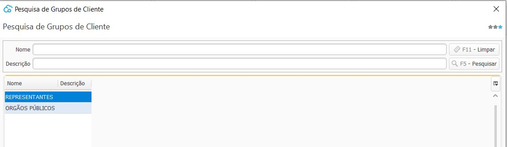

[Início](index.md) / [Vendas](vendas.md) / Grupo de Cliente

{: #grupocliente}

### Grupo de Cliente

Nesta tela é possível cadastrar os grupos de clientes que a empresa trabalha. 

A utilização de grupo de produtos não é obrigatória, mas quando os clientes estão reunidos em grupos, se torna mais prático selecioná-los nas operações de processamento, geração de consultas e emissão de relatórios .

[Voltar](vendas.md#vendas)