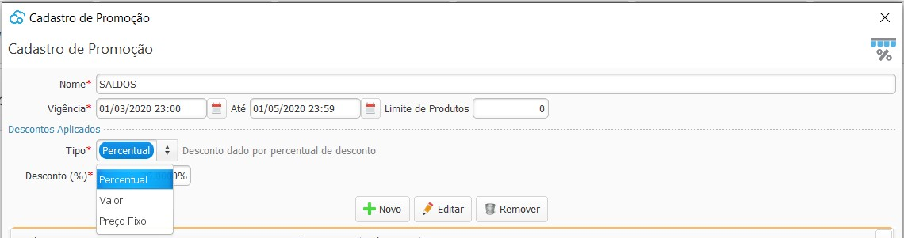
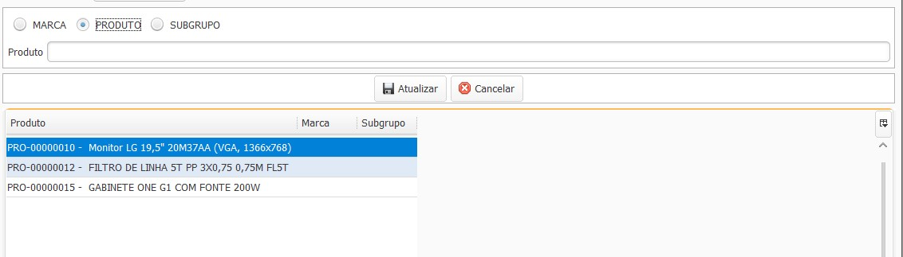

[Início](index.md) / [Vendas](vendas.md) / Promoção

{: #promocao}

### Promoção

Nesta tela podem ser cadastradas as promoções aplicáveis aos produtos. A promoção pode ser de três tipos:

*Percentual*: Neste tipo deve ser informado o percentual de desconto que será aplicado em cada um dos  produtos que estiverem parametrizados na promoção.

*Valor*: Neste tipo deve ser informado um valor fixo de desconto que será aplicado em cada um dos produtos que estiverem parametrizados na promoção.

*Preço Fixo*: Neste tipo deve ser informado um preço fixo para o produto, ou seja, o valor do desconto será variável, sendo a diferença do preço de venda do produto para preço fixado na promoção.

Os produtos que serão incluídos na promoção podem ser selecionados por Marca, Subgrupo ou produto à produto.

A promoção será aplicado em todas as vendas que forem criadas no período de vigência da promoção.

[Voltar](vendas.md#vendas)