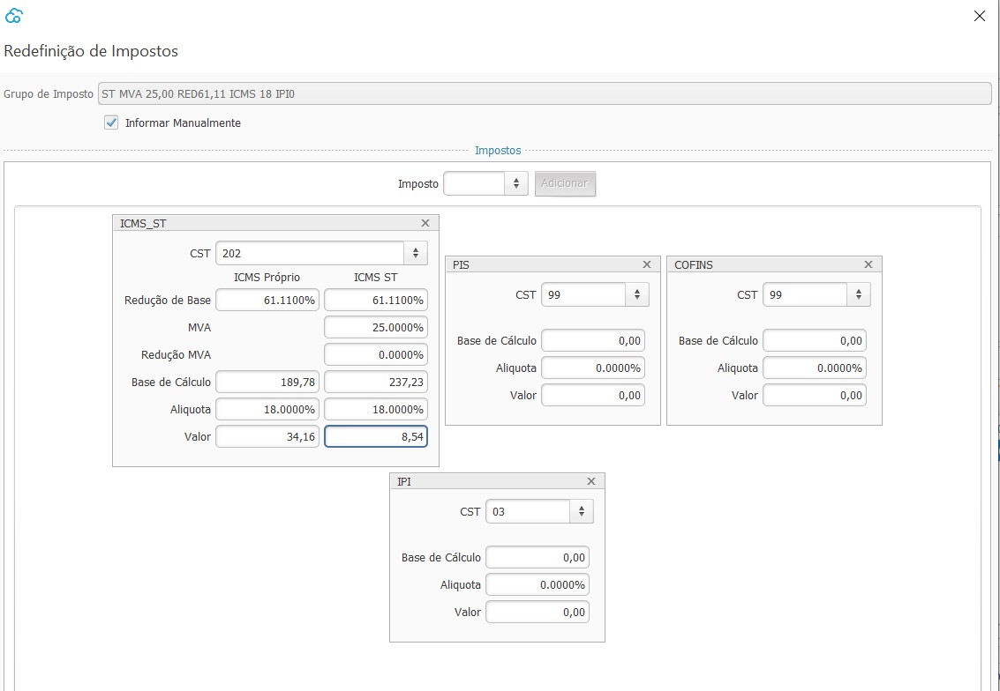
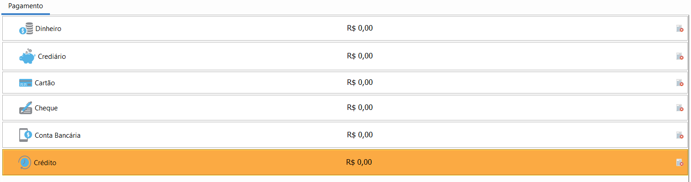
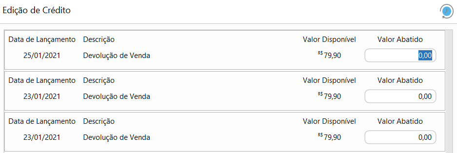
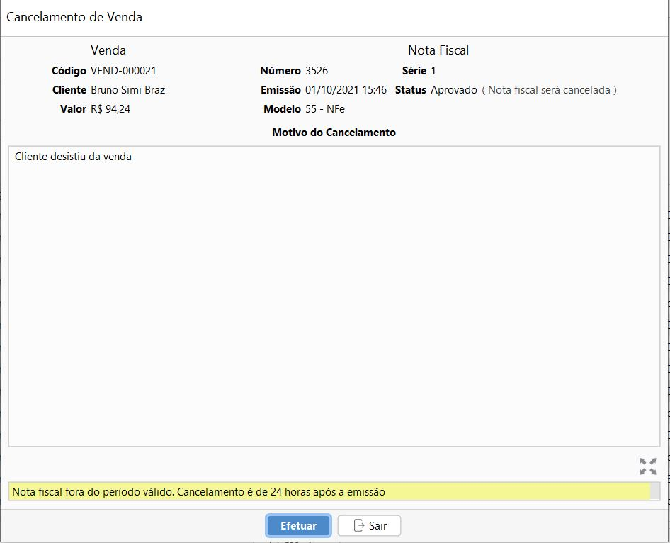

{: #venda}

### Venda

{: #pesquisavenda}

#### Pesquisa de Vendas

Nesta tela estão disponíveis todas as vendas cadastradas, as faturadas e as em aberto. O fitro padrão ao abrir a tela mostra somente as em Aberto.

Através do botão mais pode-se acessar os menus relacionados com a venda.

A opção Fatur só fica disponível para as Compras com status Aberto.

As opções Devolver e Cancelar ficam disponíveis para as Vendasus Faturadas 

{: #cadastro}

#### Cadastro de Venda

*Cliente Cadastrado:*  A busca pode ser feita tanto pelo código, digitando-o apenas parcialmente ou pela nome, também digitando-o apenas parcialmente.

*Cliente Não Cadastrado:*  Neste caso pode-se digitar o nome ou alguma identificação para o cliente, mas o cliente não é obrigatório na venda.

*Produto:*  A busca pode ser feita tanto pelo código, digitando-o apenas parcialmente ou pela nome, também digitando-o apenas parcialmente.

*Produto por código de barras:* esse é o jeito mais fácil e rápido de incluir o produto na venda, para informar a quantidade basta informar o número e *

e então basta ler o código de barras:

o sistema entende assim a quantidade é o produto informado

{: #redefinirimpostos}

#### Redefinir Impostos

Os impostos de venda são calculados automaticamente através do [Grupos de Impostos de venda](estoque_produto.md#fiscaisimpostos) parametrizado no cadastro do produto.  Para editar-os deve clicar com o botão inverso do mouse em cima da linha na grade.

Ao abrir a tela de redefinir impostos, ficam disponíveis o detalhamento dos impostos que foram calculados.

É possível alterar o grupo de impostos, e assim o sistema faz o recálculo dos impostos de acordo com o impostos do novo grupo selecionado:

Ou pode-se alterar diretamente o valor do Imposto, Base, CST calculados, para isso o campo "Informar Manualmente" deve ser marcado, assim todos os campos permitem edição.

Ao alterar os impostos manualmente o sistema não faz nenhum novo cálculo, por exemplo se for alterado a base de cálculo o sistema não recalcula o valor do imposto. 

{: #redefinirdesconotos}

#### Redefinir Descontos

Os desconto na venda são calculados automaticamente através da [promoção](estoque_promocao.md#promocao). Para editar-os  ou incluir descontos manualmente deve clicar com o botão inverso do mouse em cima da linha na grade.

Nesta tela o sistema informa o que foi calculado automaticamente e se necessário alterar ou excluir basta selecionar a opção manual e informar o novo valor de desconto ou deixa zerado.

{: #frete}

#### Frete

Na aba Frete devem ser inseridos os valores de Frete e Seguro que compõe o valor total da Nota Fiscal. 

Na parte de baixo da tela da Venda está sumarizado os totais da Venda e também os detalhes da Venda. O Documento Fiscal é carregado automaticamente conforme parametrizado nos [ajustes fiscais](sistema_ajustes_fiscal.md#geral) ou no cadastro do [cliente](vendas_cliente.md#fiscal), mas pode ser alterado manualmente, exceto quando não houver cliente que sempre será NFCE.

Ao clicar no botão Gravar a Venda poderá ser faturada no mesmo momento ou então será salva com status aberto na pesquisas de Venda.

{: #faturamento}

#### Faturamento de Venda

O faturamento de venda só estará disponível se houver um caixa aberto para o usuário. 

Nesta tela é feito o faturamento da Venda, as informações estão dispostas em 4 abas. Para NFC-e somente a aba pagamento fisca disponível.

{: #pagamento}

##### Faturamento- aba Pagamento

*Dinheiro:* Valor faturado em dinheiro, será uma saída em dinheiro no Caixa que está aberto para o usuário.

*Crediário*:  O valor faturado como crediário será levado para o [Contas a Receber](financeiro_contas_receber.md#contasreceber).

*Cartão:* O valor faturado como Cartão, seja débito, crédito, ou vales será lançado como transações para [recebimento de cartão](financeiro_administradora_cartao.md#recebimento).

*Cheque*:  O valor faturado como cheque será levado para o [Contas a Receber](financeiro_contas_receber.md#contasreceber).

*Depósito:* O valor faturado como depósito será lançado como uma entrada diretamente na conta bancária informada.

*Crédito:* Somente poderá ser faturado como crédito, se houver crédito disponível para o Cliente. Neste caso o faturamento faz o abatimento do crédito no valor informado no campo *consumido*

Após o faturamento o histórico de abatimentos e saldo de crédito para o cliente pode ser visto diretamente no [menu crédito no cadastro do cliente](vendas_cliente.md#credito).

{: #produtos}

##### Faturamento- aba Produtos

Esta  também é uma aba apenas informativa, onde poderá ser feita a conferência dos produtos que estão sendo devolvidos.

{: #transporte}

##### Faturamento- aba Transporte

Caso houver frete destacado na Venda nesta aba devem ser inseridas as informações relacionadas ao Volume da Mercadoria.

{: #informacoesadicionais}

##### Faturamento- aba Informações Adicionais

Nesta aba podem ser adicionados os textos que serão impressos no rodapé do DANFE.

*Informações Adicionais*: São informações complementares de interesse do contribuinte. Será impresso no rodapé do DANFE e na tag <infCpl> do XML. Como por exemplo número de Lote, prazo de devolução, etc... 

*Informações Fiscais*: São informações complementares de interesse do Fisco. Será impresso no rodapé do DANFE e na tag <infAdFisco> do XML. Como por exemplo informações de redução de base, empresa optante pelo Simples Nacional, etc. Para NFE esse campo pode ser automaticamente preenchido através do texto parametrizado como padrão nos [ajustes_fiscal](sistema_ajustes_fiscal.md#nfe).

Ao clicar em Faturar uma janela de comunicação com o SEFAZ é aberta, onde pode ser acompanhado o status da NF-e\NFC-e e se aprovado o DANFE pode ser impresso:

A Nota Fiscal estará disponível também na tela de Gestão de NF-e, nos documentos Tipo: Saída

{: #cancelamento}

#### Cancelamento de Venda

Para as vendas com status  Faturado, ao acessar o menu Mais a opção Cancelamento estará disponível.

O período para cancelamento  é parametrizável nos [ajustes fiscais](sistema_ajustes_fiscal.md#nfe) e deve seguir o determinado pelo SEFAZ de cada estado.

Caso a data/hora de faturamento da Venda ultrapasse o período de cancelamento paramertrizado não será possível prosseguir com o cancelamento da Venda.

O processo de Cancelamento da Venda, fará também o Cancelamento da Nota Fiscal atrelada ou o Descarte (Inutilização) da Numeração caso a Nota Fiscal esteja Rejeitada, por isso o motivo do cancelamento deve ser informado manualmente e deve ter entre 15 e 255 caracteres.

Ao efetuar o processo de cancelamento a Venda fica com status Cancelado

A Nota Fiscal atrelada à venda também fica com status  cancelado, ou Descartado caso estive rejeitada.

E as transações financeiras resultantes da Venda também ficam com status Cancelado.

[Voltar](vendas.md#vendas)

