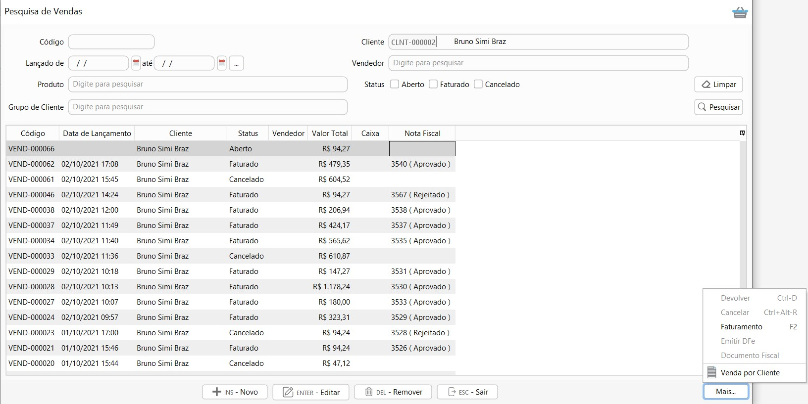
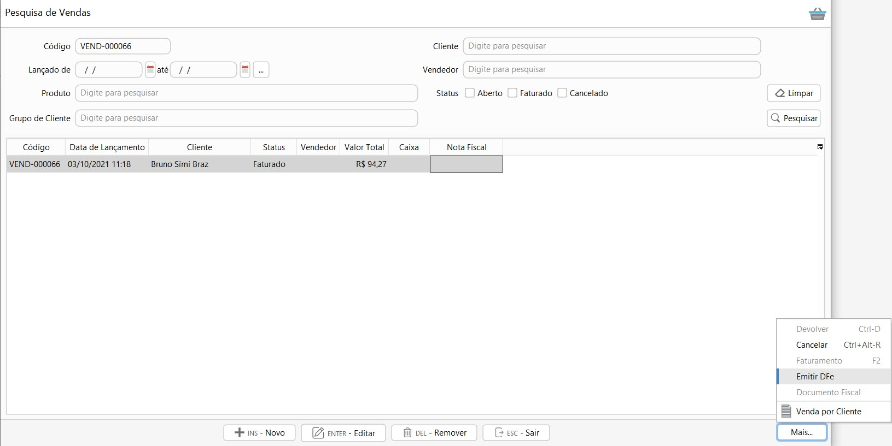
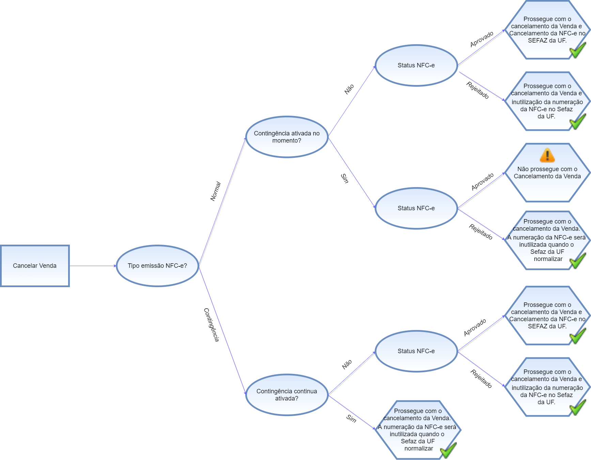
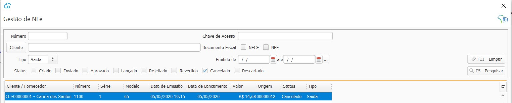

[Início](index.md) / [Vendas](vendas.md) / Venda

{: #venda}

##  Venda

{: #pesquisavenda}

### Pesquisa de Vendas

Nesta tela estão disponíveis todas as vendas cadastradas, faturadas e as em aberto. O filtro padrão ao abrir a tela mostra somente as em Aberto.

#### Status

- Aberto- Vendas já iniciadas mas não faturadas. Permitem edição.
- Faturado - Vendas já faturadas. Não permitem edição.
- Cancelado - Vendas já faturadas e canceladas. Não permitem edição.

### Processos

Através do botão `Mais` ou com o botão inverso do mouse se acessa todos os processos relacionados a Venda e também a impressão dos Tickets e relatórios.

O menu [Devolver](vendas_devolucao_venda.md#devolucaovenda) é habilitado somente se selecionado uma Venda com status Faturado e com documento fiscal emitido e aprovado.

O menu [Cancelar](vendas_venda.md#cancelamento) é habilitado somente se selecionado uma Venda com status Faturado.

O menu [Faturamento](vendas_venda.md#faturamento) é habilitado somente se selecionado uma Venda com status Aberto.

O menu [Emitir-DFe](vendas_venda.md#emissao_dfe) é habilitado somente se selecionado uma Venda com status Faturado.

{: #cadastro}

### Cadastro de Venda

#### Cliente cadastrado

Ao abrir uma nova venda a primeira informação é o Cliente, o botão vem habilitado para busca de um *Cliente Cadastrado* onde a pesquisa pode ser feita tanto pelo código, digitando-o apenas parcialmente ou pelo nome, também digitando-o apenas parcialmente. 

#### Cliente não cadastrado

Quando não houver cliente cadastrado basta clicar em cima do botão que o sistema desabilita a busca no cadastro do cliente e torna-o  em *Cliente não Cadastrado*, neste caso se tem a possibilidade de digitar o nome ou alguma identificação para o cliente, mas o cliente não é obrigatório na venda.

#### Produto por código de barras

Incluir produtos por leitura de código de barras  é o jeito mais fácil e rápido de incluir o produto na venda, para informar a quantidade basta informar o número e* e ler o código de barras

Exemplo: se a quantidade é 3 basta informar 3* e bipar o código de barras e enter que o produto será incluído na venda:

caso o produto tenha dimensões de estoque vai abrir uma janela para informar a dimensão:

####  Produto sem código de barras

Quando o produto não tem código de barras a busca pode ser feita tanto pelo código, digitando-o apenas parcialmente ou pela nome, também digitando-o apenas parcialmente no campo produto:

{: #redefinirimpostos}

#### Redefinir Impostos

Os impostos de venda são calculados automaticamente através do [Grupos de Impostos de venda](estoque_produto.md#fiscaisimpostos) parametrizado no cadastro do produto.  Para editar-os deve clicar com o botão inverso do mouse em cima da linha na grade.

Ao abrir a tela de redefinir impostos, ficam disponíveis o detalhamento dos impostos que foram calculados.

É possível alterar o grupo de impostos, e assim o sistema faz o recálculo dos impostos de acordo com o impostos do novo grupo selecionado:

Ou pode-se alterar diretamente o valor do Imposto, Base, CST calculados, para isso o campo "Informar Manualmente" deve ser marcado, assim todos os campos permitem edição.

Ao alterar os impostos manualmente o sistema não faz nenhum novo cálculo, por exemplo se for alterado a base de cálculo o sistema não recalcula o valor do imposto. 

{: #redefinirdesconotos}

#### Redefinir Descontos

Os desconto na venda são calculados automaticamente através da [promoção](estoque_promocao.md#promocao). Para editar-os  ou incluir descontos manualmente deve clicar com o botão inverso do mouse em cima da linha na grade.

Nesta tela o sistema informa o que foi calculado automaticamente e se necessário alterar ou excluir basta selecionar a opção manual e informar o novo valor de desconto ou deixa zerado.

{: #frete}

#### Frete

Na aba Frete devem ser inseridos os valores de Frete e Seguro que compõe o valor total da Nota Fiscal. 

Na parte de baixo da tela da Venda está sumarizado os totais da Venda e também os detalhes da Venda. O Documento Fiscal é carregado automaticamente conforme informado na [Parametrização Fiscal](sistema_parametrizacao.md#geral) ou no cadastro do [cliente](vendas_cliente.md#fiscal), mas pode ser alterado manualmente, exceto quando não houver cliente que sempre será NFCE.

Ao clicar no botão Gravar a Venda poderá ser faturada no mesmo momento ou então será salva com status aberto na pesquisas de Venda.

{: #faturamento}

### Faturamento de Venda

No faturamento de venda o sistema identifica automaticamente através do modelo de documento fiscal definido na venda qual documento fiscal será emitido.

Quando o faturamento da venda resultar na emissão de uma NF-e as informações ficam dispostas em 4 abas conforme imagem abaixo: 

Quando o faturamento da venda resultar na emissão de uma NFC-e somente a aba pagamento fica disponível conforme imagem abaixo. Quando NFC-e também fica disponível o campo CPF/CNPJ que caso seja um cliente cadastrado vem preenchido mas pode ser editado ou excluído. Quando o cliente não for cadastrado pode ser informado o CPF/CNPJ manualmente.

Quando informando o CPF/CNPJ ele será informado na NFC-e.

{: #pagamento}

#### Faturamento- aba Pagamento

A versão base do ERP continente nuvem não comtempla as transações financeiras, portando os montantes inseridos por forma de recebimento serão apenas informativos do documento fiscal emitido.

As transações descritas abaixo, dependem da habilitação dos módulos de Caixa e Financeiro. 

*Dinheiro:* Valor faturado em dinheiro, será uma saída em dinheiro no Caixa que está aberto para o usuário.

*Crediário*:  O valor faturado como crediário será levado para o [Contas a Receber](financeiro_contas_receber.md#contasreceber).

*Cartão:* O valor faturado como Cartão, seja débito, crédito, ou vales será lançado como transações para [recebimento de cartão](financeiro_administradora_cartao.md#recebimento).

*Cheque*:  O valor faturado como cheque será levado para o [Contas a Receber](financeiro_contas_receber.md#contasreceber).

*Depósito:* O valor faturado como depósito será lançado como uma entrada diretamente na conta bancária informada.

*Crédito:* Somente poderá ser faturado como crédito, se houver crédito disponível para o Cliente. Neste caso o faturamento faz o abatimento do crédito no valor informado no campo Valor Abatido.

Após o faturamento o histórico de abatimentos e saldo de crédito para o cliente pode ser visto diretamente no [menu crédito no cadastro do cliente](vendas_cliente.md#credito).

{: #produtos}

#### Faturamento- aba Produtos

Nesta aba poderá ser feita a conferência dos produtos e dimensões que estão sendo faturadas. 

##### Informações Adicionais do Item

Clicando com o botão inverso do mouse em cima da linha, é possível acessar a tela de informações Adicionais do Item. Essas informações são impressas como segunda linha do DANFE, abaixo da descrição do produto.

As informações são cadastradas no cadastro do [produto](estoque_produto.md #informacoesadicionais}) mas também podem ser inclusas e alteradas diretamente nesta opção no faturamento.

{: #transporte}

#### Faturamento- aba Transporte

Caso houver frete destacado na Venda nesta aba devem ser inseridas as informações relacionadas ao Volume da Mercadoria.

{: #informacoesadicionais}

#### Faturamento- aba Informações Adicionais

Nesta aba podem ser adicionados os textos que serão impressos no rodapé do DANFE.

*Informações Adicionais*: São informações complementares de interesse do contribuinte. Será impresso no rodapé do DANFE e na tag <infCpl> do XML. Como por exemplo número de Lote, prazo de devolução, etc... 

*Informações Fiscais*: São informações complementares de interesse do Fisco. Será impresso no rodapé do DANFE e na tag <infAdFisco> do XML. Como por exemplo informações de redução de base, empresa optante pelo Simples Nacional, etc. Para NFE esse campo pode ser automaticamente preenchido através do texto parametrizado como padrão na [Parametrização Fiscal](sistema_parametrizacao.md#nfe).

{: #emissaodfe}

#### Emissão de DF-e

Ao clicar em Faturar o sistema pergunta se deseja emitir  o documento fiscal agora:

Se clicar em sim, uma janela de sincronização com o SEFAZ é aberta, onde pode ser acompanhado o status da NF-e\NFC-e e se aprovado o DANFE pode ser impresso:

A Nota Fiscal estará disponível também na tela de Gestão de NF-e, nos documentos Tipo: Saída

Caso clique em não, a emissão do documento fiscal pode ser feito a depois através do menu Vendas>>Emitir DF-e

Na aba Pagamento as formas de recebimento vem preenchidas conforme informado no faturamento e não podem ser alteradas. 

A aba Produtos mostra um detalhamento dos produtos e impostos. Os impostos não são inclusos ou alterados neste momento, eles devem ser alterados na criação da venda. Nesta aba podem ser inclusos os textos como segunda linha da NF-e, basta clicar com o botão inverso do mouse em cima da linha.

Na  aba Transporte podem ser complementadas as informações do transporte de mercadoria.

Na aba Informações Adicionais  são adicionados os textos que serão impressos no rodapé da NF-e. Alguns textos são preenchidos automaticamente de acordo com o definido nos [parâmetros do sistema.](sistema_parametrizacao.md) 

Agora é só clicar em `Emitir` e pronto a NF-e será emitida e enviada para o SEFAZ. Todas as Notas fiscais emitidas podem ser consultadas na tela de [Gestão de DF-e](gestao_fiscal_gestao_dfe.md).

A NF-e aprovada é enviada automaticamente para o e-mail parametrizado no [cadastro do cliente](vendas_cliente.md).

{: #cancelamento}

### Cancelamento de Venda

Para as vendas com status  Faturado, ao acessar o menu `Mais` a opção Cancelamento estará disponível.

Se o documento fiscal ainda não tiver sido emitido o cancelamento da venda fará o retorno da mercadoria para o estoque e a reversão das transações financeiras, caso o módulo financeiro esteja habilitado.

Se o documento fiscal já tiver sido emitido, o cancelamento da venda fará também o cancelamento do documento fiscal na SEFAZ ou descarte da numeração na SEFAZ, caso o documento tenha sido rejeitado.

Antes de prosseguir com o cancelamento da venda, deve-se observar qual o modelo de documento fiscal amarrado à venda (NF-e ou NFC-e) tipo de emissão (normal ou contingência) e o período de cancelamento.

#### Cancelamento de NF-e

#### Tipo de emissão: Normal ou em Contingência

#### Cancelamento de NFC-e

##### Tipo de emissão: Normal ou em Contingência

#### Período Cancelamento

Observadas as regras relacionadas ao Tipo de emissão, deve-se atentar ao período permitido para o cancelamento. 

O período para cancelamento de venda é variável de acordo com o tipo, se for uma NF-e ou NFC-e e status do documento Fiscal emitido, se estiver aprovado ou rejeitado. Para cada uma dessas situações existe um campo específico para parametrização do período permitido para cancelamento na tela de [Parametrização Fiscal](sistema_parametrizacao.md#nfe).

Quando o período decorrente entre o faturamento até cancelamento da venda ultrapassar o período de cancelamento parametrizado não será possível prosseguir com o cancelamento da Venda.

A  descrição do motivo é obrigatória e deve ter entre 15 e 255 caracteres, que é o limite estabelecido pelo layout da NF-e para o envio do cancelamento para o SEFAZ. O processo de Cancelamento da Venda faz Cancelamento ou o Descarte (Inutilização) da  Nota Fiscal atrelada a Venda. Caso a Nota Fiscal esteja Rejeitada  executa o Descarte (Inutilização) da numeração e caso esteja aprovada processa o cancelamento da NF-e.

A Nota Fiscal atrelada à venda também fica com status  cancelado, ou Descartado caso tenha sido rejeitada.

E as transações financeiras resultantes da Venda também ficam com status Cancelado.

[Voltar](vendas.md)                                                                                                                                      

